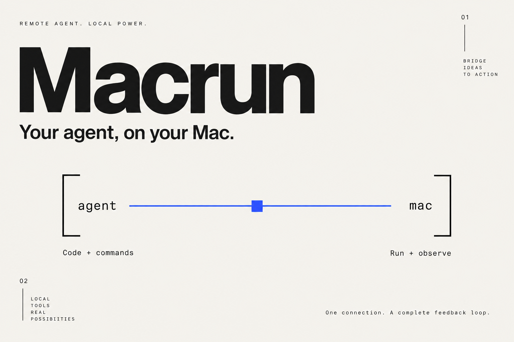
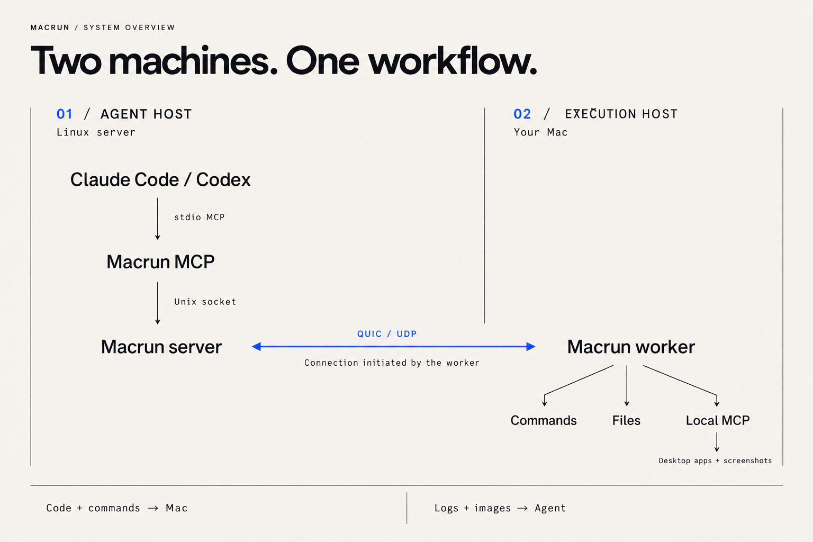

<h1 align="center">Macrun</h1>

<h3 align="center">让服务器上的 AI Agent，直接用上你的 Mac。</h3>

<p align="center">
  <a href="README.md">English</a> · <a href="README.zh-CN.md">简体中文</a> · <a href="#开始使用">开始使用</a> · <a href="#让-agent-帮你安装">让 Agent 帮你安装</a>
</p>



<p align="center"><strong>Macrun 让远程服务器上的 Claude Code、Codex 等 AI Agent，能够在你的 Mac 上执行命令、同步代码、操作应用。</strong></p>

<p align="center">Agent 继续在 Linux 服务器上工作，你现有的 Mac 负责 macOS 应用编译、测试和桌面操作。Macrun 把任务交给 Mac，再把日志、文件和截图传回 Agent，让它根据真实结果继续修改和验证。</p>

<p align="center"><strong>开源 · MIT · macOS / Linux · 0.2 demo</strong></p>

## 它能帮我做什么？

假设你想对服务器上的 Agent 说：

> “把这个项目同步到我的 Mac，运行测试，启动应用，检查按钮是否正常，最后把结果给我看。”

Macrun 提供了完成这件事所需的工具：

| 你想做的事 | Macrun 提供的能力 |
| --- | --- |
| 在另一台电脑上编译或测试 | 远程执行 shell 命令，指定工作目录、环境变量和超时，查询日志与退出码 |
| 不提交代码就测试最新改动 | 单向同步源码，包含未提交文件，也支持持续监听同步 |
| 等待耗时构建，又不占住一次工具调用 | 立即获得任务编号，稍后查询进度和结果 |
| 知道 Mac 上到底发生了什么 | 读取文件、下载产物，把截图作为图片返回给 Agent |
| 点击、输入、检查桌面应用 | 调用 Mac 上安装的 computer-use MCP 工具，例如 CuaDriver |

**Macrun 负责连接 Agent 和电脑，具体工作由你已有的工具完成。** 它不内置编译器或桌面自动化引擎。执行命令、同步文件只需要 Macrun；操作界面时，再接入本地 computer-use 工具。Agent 根据项目选择真正的构建命令，并检查执行结果。

### 我需要它吗？

如果你的 Agent 和需要执行任务的环境在 **不同机器上**，Macrun 就适用。例如 Claude Code 跑在云端 Linux，而 Xcode 和被测应用在家里的 Mac mini 上。

如果 Agent 本来就运行在这台 Mac 上，你可能只需要本地 computer-use 工具。如果你想手动远程控制整张桌面，应该使用远程桌面软件；Macrun 提供的是 Agent 工具接口和命令行。

## 它怎么工作？



整个系统只有两端：

1. **你的服务器：** 运行 Agent、存放源码，同时运行 Macrun 服务端。Agent 通过 MCP 调用 Macrun；MCP 是 Claude Code、Codex 支持的工具接口。
2. **你的 Mac：** 运行 Macrun worker，负责执行命令、接收文件和调用本地桌面工具。

连接由 Mac 主动发起，所以不需要给家里的 Mac 开公网入站端口。Mac 必须能访问服务器的 UDP 地址，可以直连，也可以走已有的 Tailscale 等私网。任务与结果使用 QUIC 传输；下面的 SSH 仅用于安装时复制文件。

架构图展示的是常见的 Linux → Mac 场景，程序也支持 Linux worker。所有运行模式使用同一个 `macrun` 可执行文件。

macOS 桌面端正在进行完整验收，构建、邀请配对、安全设置及验证边界见 [桌面说明](desktop/README.md) 和 [验收清单](docs/desktop/completion-checklist.md)。

在项目根目录运行 `make desktop-build` 编译 macOS 应用，运行 `make desktop-dev` 启动开发应用（支持热更新）。需要更快编译时使用 `make desktop-build PROFILE=debug`。

## 开始使用

最容易理解的起点是：**先连接两台机器，在 Mac 上成功执行一条命令**，再接入 Agent 和可选的桌面工具。

你需要准备：

- 一台可以登录的 Linux 服务器，以及一台能打开终端的 Mac。
- 两端的 Git、Make 和 C 编译器。Mac 运行 `xcode-select --install`；Ubuntu 安装 `git build-essential curl ca-certificates`。
- 一个 Mac 能通过 UDP 访问的服务器 IP；下文使用 `7443` 端口。

下面采用源码安装，`make deps` 会按需准备 Rust。两端各自构建时 **不需要 Docker**。请使用同一 Git 版本构建两端。

### 1. 在两台机器上安装 Macrun

先在 **Linux 服务器** 执行一次，再在 **Mac** 执行一次：

```bash
git clone https://github.com/mylxsw/macrun.git
cd macrun
make deps
make install
export PATH="$HOME/.local/bin:$PATH"
macrun --version
```

`make install` 会构建并安装到 `~/.local/bin`。这里的 `export` 只对当前终端生效；以后可使用程序完整路径，或把该目录加入 shell 的 PATH。

想只在 Mac 上构建，再把 Linux 程序拷贝到服务器？见 [构建选项](#构建选项)。

### 2. 启动服务端

在 **Linux 上** 执行：

```bash
export MACRUN_SOCKET="$HOME/.local/share/macrun-server/control.sock"
macrun init --data "$HOME/.local/share/macrun-server"
macrun serve --listen 0.0.0.0:7443 \
  --data "$HOME/.local/share/macrun-server"
```

保持这个终端运行。`init` 只在首次安装时执行，用于生成连接凭据，不会覆盖已有身份。服务器所用网络路径需要放行 UDP `7443`；也可以用私网 IP 替换 `0.0.0.0`，只监听该接口。

### 3. 连接你的 Mac

在 **Mac 上** 设置 SSH 别名和服务器 IP。下面的 IP 只是占位示例：

```bash
SERVER_SSH=your-server-ssh-alias
SERVER_IP=192.0.2.10  # 替换为你的服务器可达 IP
mkdir -p "$HOME/.local/share/macrun-worker"

scp "$SERVER_SSH:.local/share/macrun-server/cert.der" \
  "$HOME/.local/share/macrun-worker/"
scp "$SERVER_SSH:.local/share/macrun-server/token" \
  "$HOME/.local/share/macrun-worker/"
chmod 600 "$HOME/.local/share/macrun-worker/token"

macrun worker --server "$SERVER_IP:7443" \
  --cert "$HOME/.local/share/macrun-worker/cert.der" \
  --token-file "$HOME/.local/share/macrun-worker/token" \
  --data "$HOME/.local/share/macrun-worker"
```

这个终端也保持运行。SSH 别名需要登录到第 2 步使用的 Linux 用户。Mac 只需要证书和 token；服务端的 `key.der` 留在 Linux 上。

### 4. 执行第一条远程命令

再打开一个 **Linux 终端**：

```bash
export PATH="$HOME/.local/bin:$PATH"
export MACRUN_SOCKET="$HOME/.local/share/macrun-server/control.sock"

macrun status
macrun exec --cwd /tmp 'hostname; uname -m; echo hello-from-mac'
macrun task TASK_UUID
```

将 `TASK_UUID` 替换为 `exec` 返回的 `task_id`。如果任务还在运行，稍后再次查询。

**看到这些就说明成功了：** 连接状态为 `connected: true`；任务最终为 `status: succeeded`、`result.exit_code: 0`；输出包含 **Mac 的主机名**、架构和 `hello-from-mac`。

至此，两台机器已连通。希望关闭终端后仍然运行，请继续阅读 [后台运行与重启手册](docs/operations.md)。

## 接入 Claude Code 或 Codex

在 **运行 Agent 的 Linux 服务器上** 注册工具。按你使用的客户端选择：

```bash
# Claude Code
claude mcp add --scope user macrun -- "$HOME/.local/bin/macrun" \
  --socket "$HOME/.local/share/macrun-server/control.sock" mcp
claude mcp get macrun

# Codex
codex mcp add macrun -- "$HOME/.local/bin/macrun" \
  --socket "$HOME/.local/share/macrun-server/control.sock" mcp
codex mcp get macrun
```

已有名为 `macrun` 的配置时，先检查，不要重复添加。新开 Agent 会话，然后告诉它：

> “使用 Macrun 检查已连接的电脑，在上面运行 `hostname` 和 `uname -m`，等待任务完成，把输出告诉我。”

### 安装 Skill，让 Agent 知道怎样使用

MCP 提供工具，[Macrun Skill](skills/macrun/SKILL.md) 告诉 Agent 何时同步、如何等待任务、断线后怎样避免重复执行，以及怎样确认界面操作真的生效。

在 **Linux 上的 Macrun 源码目录中**，为你使用的客户端安装：

```bash
# Claude Code
mkdir -p ~/.claude/skills
test -e ~/.claude/skills/macrun || cp -R skills/macrun ~/.claude/skills/macrun

# Codex
mkdir -p ~/.agents/skills
test -e ~/.agents/skills/macrun || cp -R skills/macrun ~/.agents/skills/macrun
```

需要复制整个目录。命令不会覆盖已有安装，升级时请先比较再更新。新会话中，Claude Code 使用 `/macrun`，Codex 使用 `$macrun`。也可以放在具体项目的 `.claude/skills/` 或 `.agents/skills/` 中。

## 用它完成实际工作

### 同步项目并运行测试

在 **Linux 上的源码项目** 中创建 `macrun.toml`：

```toml
remote_root = "/Users/YOUR_USER/work/my-app"
exclude = ["node_modules", "dist", ".env", ".env.*"]
sync_timeout_seconds = 120
```

把 `remote_root` 换成你希望同步到的 **Mac 目录**。在 Linux 项目目录中执行，并沿用前面设置的 `MACRUN_SOCKET`：

```bash
macrun sync
macrun exec --cwd /Users/YOUR_USER/work/my-app 'make test'
macrun task TASK_UUID
```

`make test` 只是示例，请换成项目真正的测试命令。命令执行不会自动同步源码，构建前要等待同步成功。通过 MCP 使用时，从源码项目目录启动 Agent，或给 `sync_start` 显式传入服务器端 `workspace`。

如果想持续更新工作副本：

```bash
macrun sync --watch --interval-ms 1000
```

保持进程运行，Ctrl-C 停止。它会同步未提交改动，传播已受管理文件的删除，同时保留 Mac 上生成的无关文件；它不会自动触发构建。若构建要求源码不变，请暂停编辑和 watcher，或使用固定副本。

### 取回文件

在 **Linux 上** 执行；命令中的远程路径指向 Mac：

```bash
macrun call file.read --args '{"path":"/tmp/report.txt","text":true}'
macrun download /tmp/report.txt ./report.txt
macrun upload ./input.zip /tmp/input.zip
```

Agent 也可以通过 `file_image` 读取 Mac 上的 PNG/JPEG。图片必须已经存在，这个工具本身不负责截图。

### 让 Agent 看见并操作应用

先在 **Mac 上** 安装一个 computer-use 工具，Macrun 通过它的 stdio MCP 接口进行调用。对于已经安装的 CuaDriver，创建 `worker.toml`：

```toml
[mcp.computer]
command = "/Applications/CuaDriver.app/Contents/MacOS/cua-driver"
args = ["mcp"]
```

在第 3 步的 worker 启动命令末尾追加 `--config /absolute/path/to/worker.toml`，然后重启 worker。桌面工具需要自己的 macOS 权限和可用的图形登录会话，检查方法见 [运维手册](docs/operations.md#computer-use-backend)。

然后告诉 Agent：

> “使用 Macrun 发现 computer 工具，打开 Mac 上的计算器，计算 12 × 34。返回一张新的截图，确认结果是 408。”

Agent 会先发现这个工具实际支持的操作，再调用并查询任务结果。截图以图片内容返回，Agent 可以直接查看。不能只看“点击已发送”，还应读取操作后的画面，确认结果。

## 让 Agent 帮你安装

把下面的请求发给有权限访问你机器的 Agent，并替换 `SERVER` 和 `MAC`：

> 阅读 https://github.com/mylxsw/macrun/blob/main/docs/agent-install.md ，将 Macrun 服务端安装到 SERVER，将 worker 安装到 MAC。先检查架构和现有环境，再配置已安装的 Claude Code/Codex 及 Macrun Skill，最后验证一条真实远程命令。如果已具备 computer-use 工具，再验证截图返回。明确告诉我还有哪些步骤需要我操作。

[Agent 安装手册](docs/agent-install.md) · [供 Agent 读取的原始 Markdown](https://raw.githubusercontent.com/mylxsw/macrun/main/docs/agent-install.md)

手册覆盖首次安装、已有配置、后台服务、客户端接入和验收方法，不绑定个人主机地址，也不会在未检查现有工具时直接替你安装桌面 backend。

## 哪些已经可用，哪些还不承诺？

Macrun 是一个 **已跑通的 demo**，还不是面向生产环境的远程执行平台。

- **已经验证：** 命令、文件、同步/watch、异步结果，以及真实 Linux ARM64 → Mac 通信；通过 CuaDriver 启动计算器、点击按钮，再通过 MCP 返回截图。详见 [验证记录](docs/validation.md)。
- **网络中断：** 任务保留在 worker，重连后可以查询。worker 重启可能使任务变为 `unknown`，不会自动重跑。发送结果不确定时复用任务请求编号，避免重复操作。
- **连接范围：** 每台服务器可连接多个客户端，每个客户端最多同时连接 16 台服务器。服务器有多个在线客户端时，必须指定 `client_id`。配置见[多对多连接说明](docs/many-to-many.md)。仍面向受信任的单用户环境，仅使用 QUIC/UDP；没有交互式终端或自动构建编排。
- **桌面限制：** 不承诺休眠、注销或重启后的无人值守稳定性。真实应用测试仍依赖你的工具、权限和登录会话。

长任务会立即返回编号，由 Agent 后续查询并检查最终状态和实际退出码。完整工具约定、文件限制和恢复规则见 [使用 Skill](skills/macrun/SKILL.md) 及其 [CLI 参考](skills/macrun/references/cli.md)。

## 构建选项

以下命令都在源码仓库根目录执行。`make build` 只生成项目内的产物，只有 `make install` 才安装本机程序。

| 命令 | 结果 |
| --- | --- |
| `make deps` | 准备 Rust/工具并下载锁定依赖 |
| `make build-client` | 本机程序；例如 Apple Silicon 的 `dist/darwin-arm64/macrun` |
| `make build-server PLATFORM=linux/amd64` | 通过 Docker 构建 Linux x86-64 程序：`dist/linux-amd64/macrun` |
| `make build-server PLATFORM=linux/arm64` | 通过 Docker 构建 Linux ARM64 程序：`dist/linux-arm64/macrun` |
| `make install PREFIX=/your/path` | 把本机程序安装到 `/your/path/bin/macrun` |
| `make check` | 格式检查、lint 和 Rust 测试 |
| `make smoke` | 本机连接、同步、命令、文件和 MCP 测试，backend 使用 fixture |
| `make help` | 查看全部目标与可配置选项 |

Linux 本机 `make build` 不需要 Docker。跨平台构建要按 **Linux 服务器的架构** 选择，再把产物复制过去安装。Docker 产物使用 Debian bookworm/glibc，不是静态 musl。`PROFILE=debug` 输出到 `dist/debug/<平台>/macrun`，中间文件保留在 `target/`。

`make deps` 不安装 Xcode、Docker、Python 或桌面工具。冒烟测试需要 Python 3。Mac 有 Docker 时，`make cross-smoke` 可验证 Linux **amd64** 容器与 Mac worker 的连接；fixture 测试不等于真实 GUI 验收。

## 查看运行日志

服务端和 Worker 默认向 stderr 输出带 UTC 时间的 JSON 日志。每次操作记录名称、请求编号、耗时和结果；后台任务结束时另记一条完成日志，MCP 调用还会记录后端和工具名称。心跳、文件内容和命令输出不会刷入运行日志。Linux 使用 `journalctl -u macrun-server -f`，Mac 查看 LaunchAgent 配置中的 `StandardErrorPath`。详细说明见[运维手册](docs/operations.md#operational-logs)。

## 文档与参与贡献

桌面客户端规划与交互原型（尚未实现）：[设计与执行方案](docs/desktop/README.md)。

| 你想了解 | 对应文档 |
| --- | --- |
| 让 Agent 安装配置 Macrun | [Agent 安装手册](docs/agent-install.md) |
| 后台运行、日志、重启、排错和升级 | [运维手册](docs/operations.md) |
| 指导 Agent 正确使用工具 | [Macrun Skill](skills/macrun/SKILL.md) |
| 内部实现 | [设计说明](docs/design.md) |
| 到底做过哪些测试 | [验证记录](docs/validation.md) |
| 提交修复或改进 | [贡献指南](CONTRIBUTING.md) |

遇到问题？欢迎 [提交 Issue](https://github.com/mylxsw/macrun/issues)，附上系统、架构、Macrun 版本、已脱敏的相关日志和预期行为。

采用 [MIT 许可证](LICENSE)。
