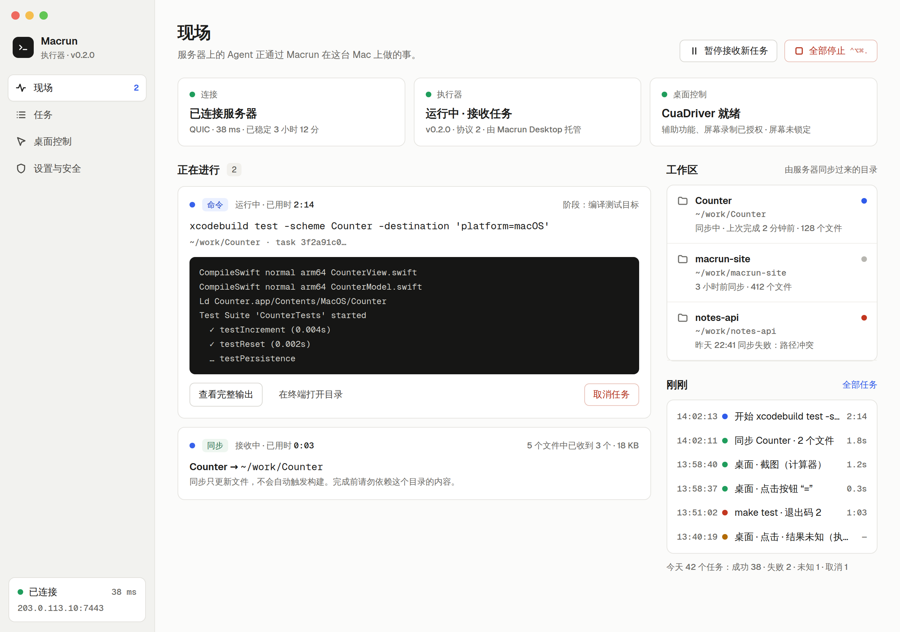
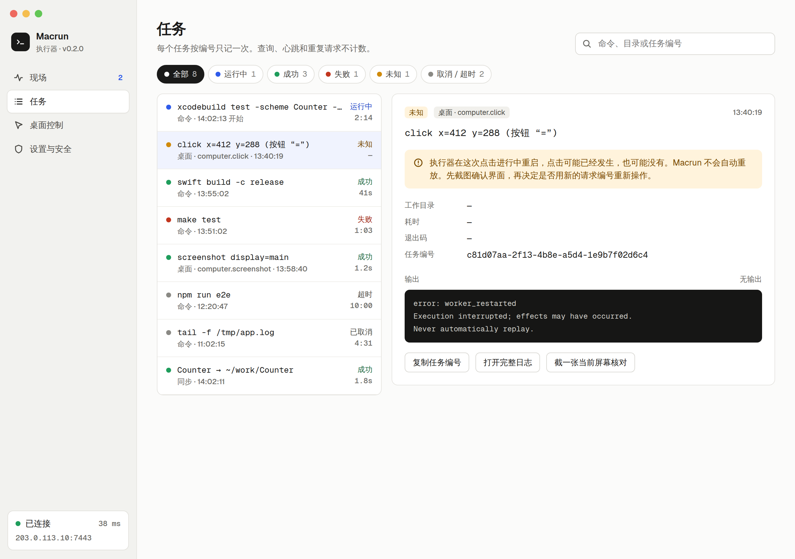
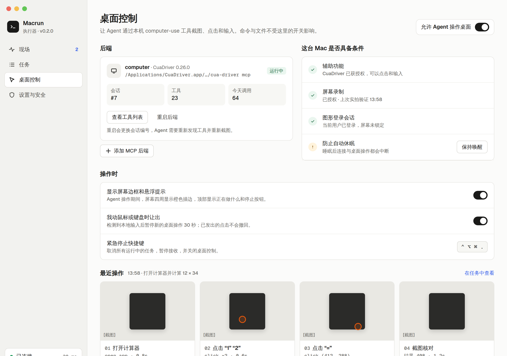
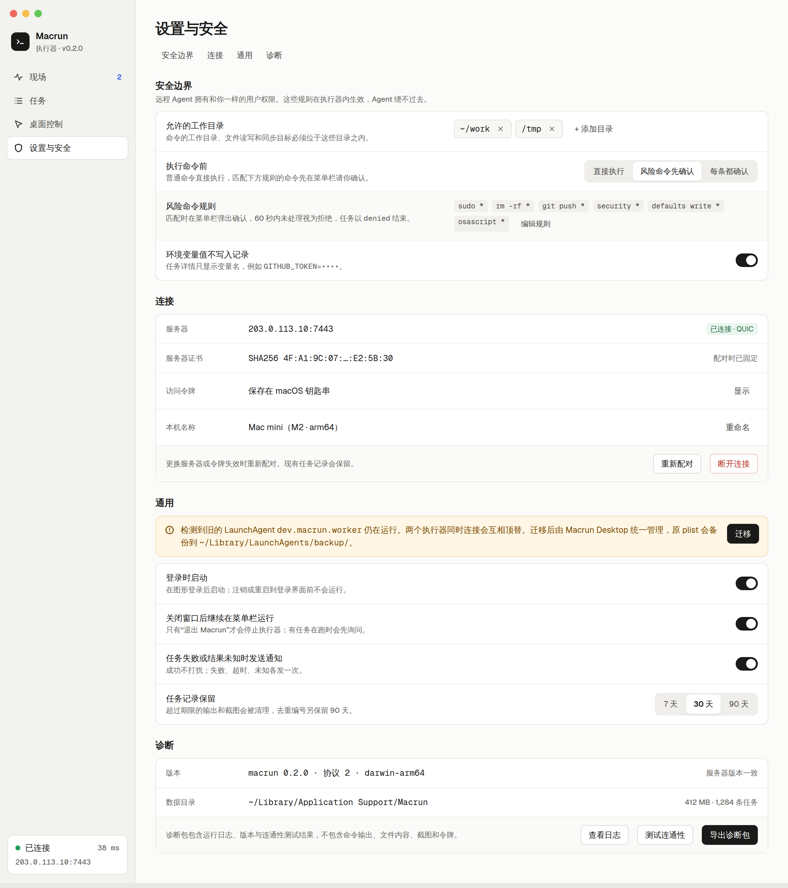
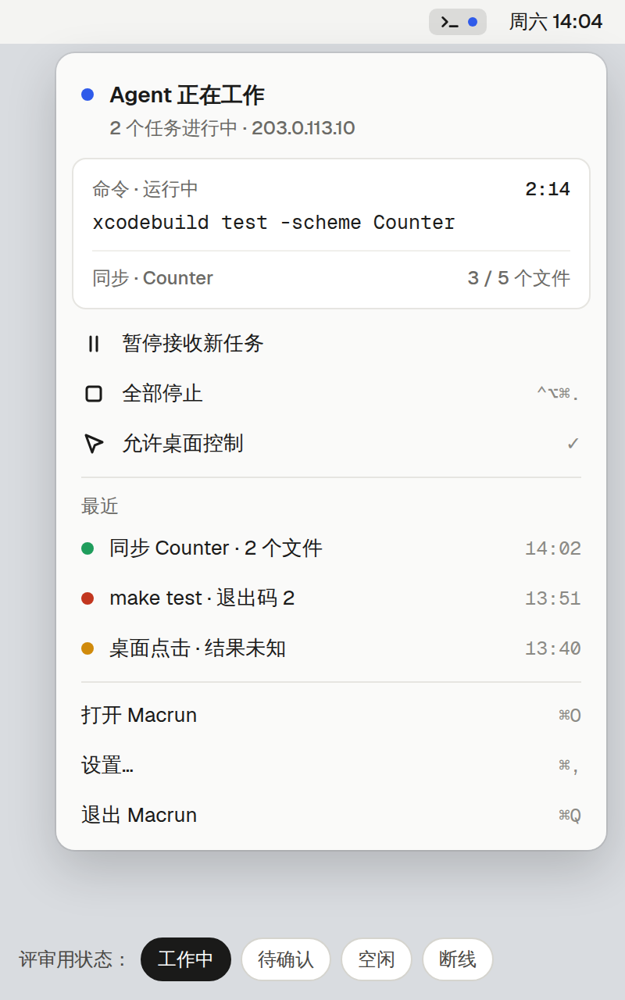
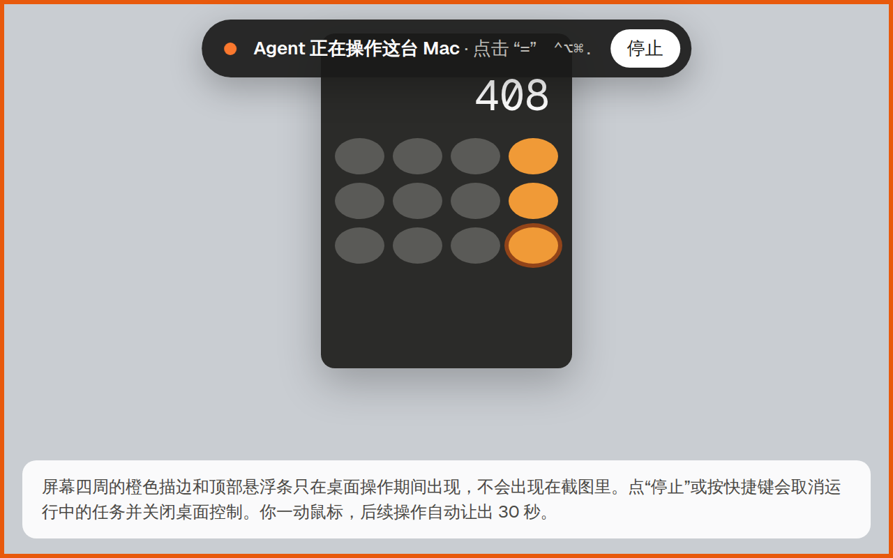
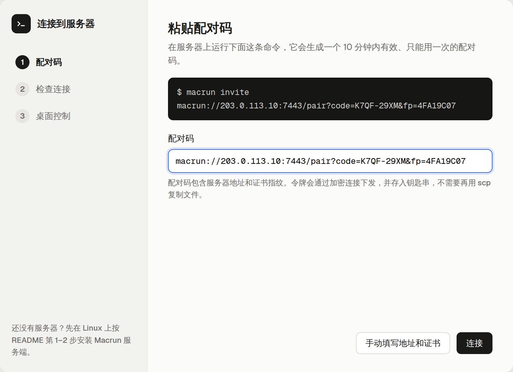

# 桌面客户端规划与设计

状态：设计稿 v2 正在进行完整功能开发与验收。实际完成边界见 [完整验收清单](completion-checklist.md)。记录日期：2026-10-04。

运行方法见 [桌面开发入口](../../desktop/README.md)，实际验收与剩余范围见 [开发记录](development.md)。

v2 替代 2026-10-04 早些时候归档的 v1 交互原型。v1 以统计看板为主，缺少“看得见、停得住、管得住”这部分，因此重做。v1 原型可在 Git 历史中查看（提交 `150dc53`）。

## 已确认方向

- 当前优先让开源用户方便地安装和使用，商业化方案暂缓。
- 增加有界面的桌面应用，平时常驻 macOS 菜单栏，由它托管本机执行程序（worker）。
- 桌面框架选择 **Tauri**，保留现有 Rust 核心。
- 架构考虑 Windows 扩展；当前不承诺 Windows 发布日期及功能完整度。

## 文档入口

| 文件 | 内容 |
| --- | --- |
| [v3 重新评估与设计稿](redesign-v3/README.md) | 实机验证发现的问题、菜单栏与主窗口 v3 设计、实施清单（提案，尚未实现） |
| [功能规划与交互设计](design.md) | 用户问题、信息架构、功能清单与优先级、核心改动、待确认事项 |
| [执行计划](implementation-plan.md) | 建议架构、阶段、验收边界与 Windows 适配 |
| [UI 还原交接](ui-handoff.md) | 最新任务：按 v2 设计修复还原度，含源码入口、检查线索与交付要求 |
| [v2 界面还原复查](ui-review/README.md) | 七页修改前后截图、原生交互与构建记录、测试数据和验收边界 |
| [旧版执行器迁移修复](migration-repair.md) | 迁移按钮无反馈的原因、状态保留、失败回退及验证记录 |
| [原生验收接续](native-acceptance.md) | 应用授权的官方入口、可复制的接续指令与剩余验收流程 |
| [交互原型](prototype/index.html) | 单文件 HTML，下载后用桌面浏览器离线打开 |
| [设计源文件](prototype/screens/) | 每个画板一个 `.dc.html`，`build.cjs` 由它们生成 `index.html` |

## 设计稿预览

### 主窗口 · 现场
回答“Agent 此刻在我的 Mac 上做什么”：三条独立状态、正在运行的命令与实时输出、同步进度、工作区和最近事件。



### 主窗口 · 任务
全部 7 种真实任务状态可筛选；`unknown` 单独解释，不自动重放，提供截图核对入口。



### 主窗口 · 桌面控制
总开关、computer-use 后端、本机条件检查、操作时行为（屏幕提示、让出、紧急停止）和最近操作回放。



### 主窗口 · 设置与安全
允许的工作目录、命令确认三档、连接、旧 LaunchAgent 迁移、通用和诊断。



### 菜单栏 · 屏幕提示 · 首次配对

<p>


</p>



## 体验原型

下载 `prototype/index.html`，用桌面浏览器打开（GitHub 文件页只显示源码）。顶部标签切换画板，地址栏带 `#Tasks` 等锚点可直接定位。

1. 现场：点“暂停接收新任务”，观察执行器状态和提示条。
2. 任务：切换状态筛选，点选不同任务查看详情；默认选中的是 `unknown`。
3. 桌面控制：关闭总开关。
4. 设置：切换“执行命令前”的三档，观察风险命令规则的显示。
5. 菜单栏：底部切换工作中 / 待确认 / 空闲 / 断线；在待确认状态点“允许一次”。
6. 首次配对：点“连接”“继续”走完三步。

所有数据均为示例，不会连接服务器或执行命令。菜单栏画板底部的状态切换仅用于评审，不是产品功能。字体从 Google Fonts 加载，离线时退回系统字体。

## 修改设计稿

编辑 `prototype/screens/*.dc.html` 后重新生成原型和截图：

```bash
node docs/desktop/prototype/build.cjs
node docs/desktop/prototype/check.cjs
```

`check.cjs` 校验 `index.html` 与源文件一致，并在 Node.js 中运行各画板的状态逻辑（暂停、筛选、选中、模式切换、配对步骤）。它不检查布局，不能代替浏览器评审。

截图使用 Chrome 无头模式生成，`#shot/<画板>` 会隐藏原型顶栏，例如：

```bash
cd docs/desktop
google-chrome --headless=new --hide-scrollbars --force-device-scale-factor=2 \
  --window-size=1280,900 --screenshot=images/main.png \
  "file://$PWD/prototype/index.html#shot/Main"
```

画板尺寸：现场、任务、桌面控制 1280×900；设置 1280×1440；菜单栏 400×640；屏幕提示 640×400；首次配对 800×580。
