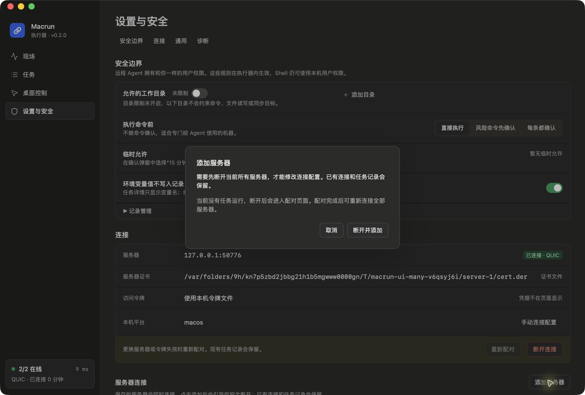
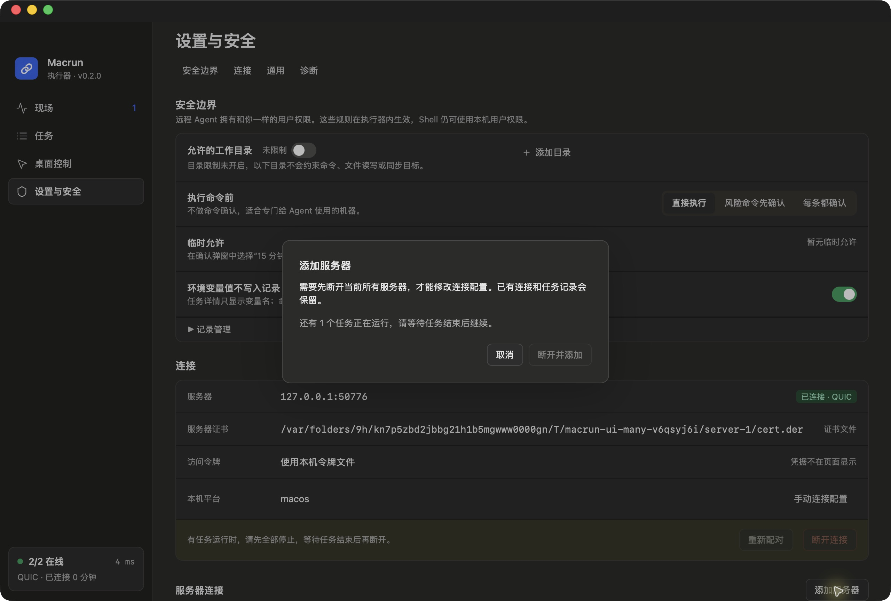
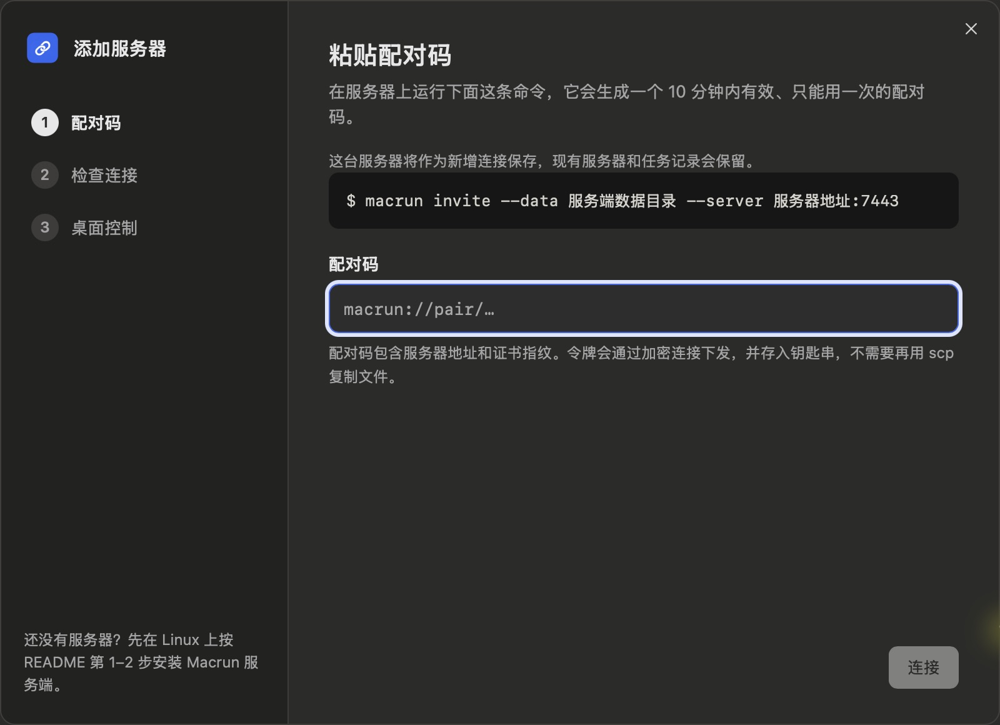

# 添加服务器交互修复

2026-10-05。用户反馈已安装应用中“添加服务器”点击无反应。

## 原因与修改

正式应用确实已安装并重启上一轮多服务器版本，安装主程序的 SHA-256 与 release 构建产物一致。问题是设置页在执行器运行时直接禁用添加按钮，附近文字说明不够明显。

现在连接运行时仍可点击添加，弹窗解释需要断开全部连接且保留配置与记录。有活动任务时显示数量并等待完成；空闲时提供“断开并添加”。取消不会停止任务。已停止时直接进入新增配对页面。

确认断开时，执行器锁住所有连接的任务接收入口，检查每个连接没有活动任务，再停止。任一连接繁忙时，不改变其他连接的运行策略、不取消任务。桌面应用等待子进程实际退出后才进入配对页；失败时保留弹窗并显示原因，按钮可重试。退出确认、紧急停止和原有普通断开行为保留。

## 验证

- 前端：17 项模型／样式检查、97 项组件测试通过，新增有任务提示、Escape 与焦点恢复、等待断开和重复点击保护、失败保留状态、停止后直接配对四项回归；TypeScript 和 Vite 构建通过。
- 核心：44 项 Rust 测试通过。新增两连接测试证明第二连接繁忙不会取消任务或暂停第一连接；完成后才允许停止全部连接，停止后不再接收新任务。
- 桌面：24 项 Rust 测试通过；核心和桌面 clippy 拒绝警告检查通过，debug 与签名 release 应用构建通过。
- 实际 Tauri 隔离应用连接两台真实本地 QUIC 服务器：连接中点击添加出现提示，确认断开进入添加配对页，关闭后两项配置仍在，重连恢复两台在线；第二台服务器执行 20 秒任务时明确提示等待，取消后该任务正常完成、exit 0。

本轮核对入口、断开、等待与取消流程，未通过界面兑换新配对码或新增钥匙串账户。配对握手本身由原有真实 QUIC 测试覆盖。截图均来自隔离应用，不包含正式任务内容。

## 截图

空闲连接时的确认：

第二台服务器有任务时的等待提示：

执行器实际退出后进入新增配对页：

