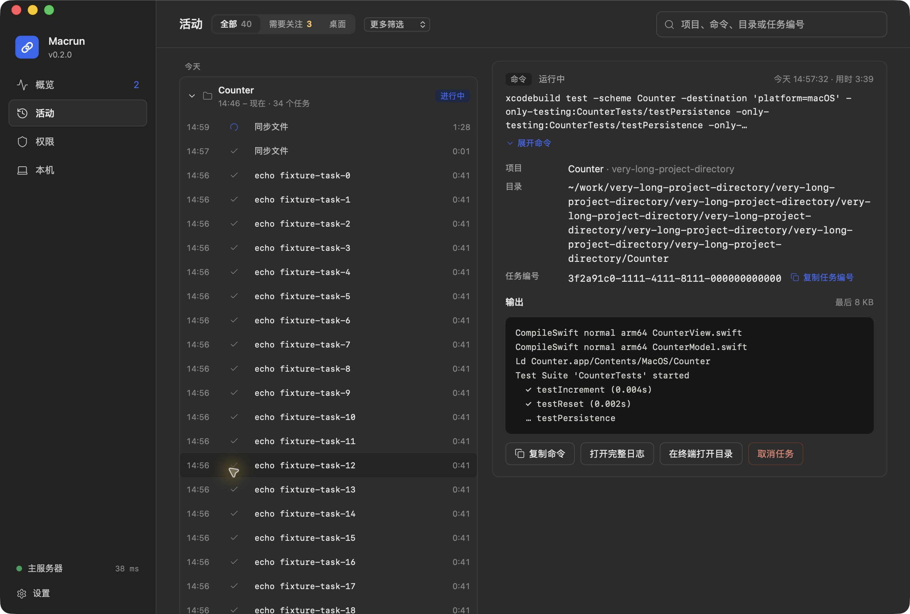
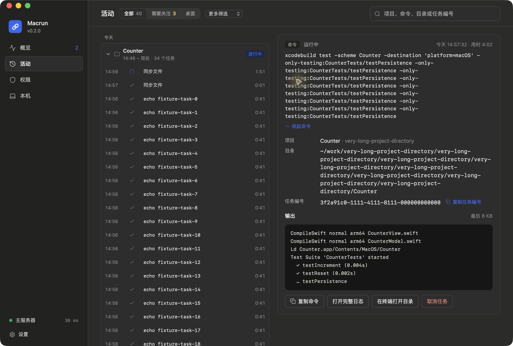

# 活动页命令预览复查

2026-10-05：按用户反馈调整活动页任务详情中的原始命令，保留 v4 的页面结构。

- 字号从 15 px 改为 12.5 px，行高 19 px。
- 默认最多显示三行，按实际换行高度判断是否需要“展开命令”。短命令不显示多余按钮。
- 展开后显示完整文本，可以再次收起；原始换行保留，连续长字符串也能换行。
- 切换任务默认收起，同一任务的状态更新保留展开状态；窗口尺寸变化时重新判断是否超过三行。
- “复制命令”始终复制完整原文。审批确认区的命令显示不受此次修改影响。

验证：`npm test` 通过 28 项模型／样式检查和 112 项组件测试；TypeScript、Vite、debug 与 release 应用构建通过，正式安装包签名验证通过。新增回归覆盖键盘展开／收起、宽度变化、任务切换、实时更新及完整命令复制。

通过独立 debug 应用及 `long` 夹具实测三行预览、展开、收起和短命令无按钮。以下是 macOS 窗口实拍，数据来自隔离夹具，不代表真实命令执行结果：

正式应用在现有任务完成后更新安装并重启，恢复原有任务接收状态和服务器连接。在真实历史命令中再次检查默认三行、展开及切换任务后收起。包含私人历史的正式应用截图仅保存在本地 `.local/command-preview/installed.jpg`，不进入仓库。
