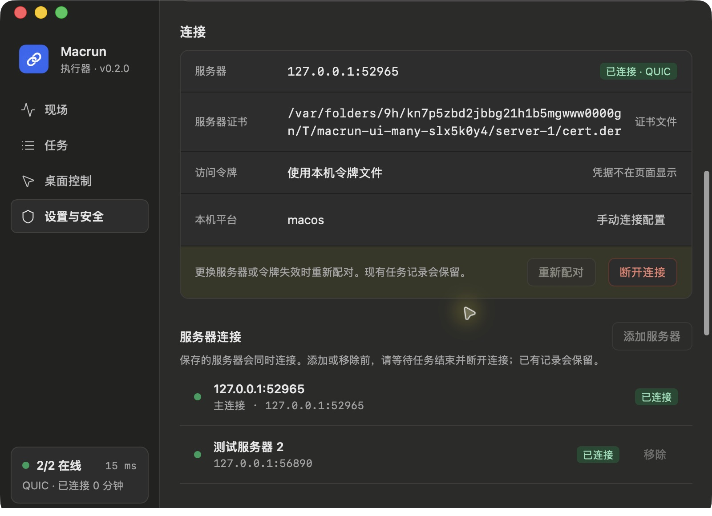
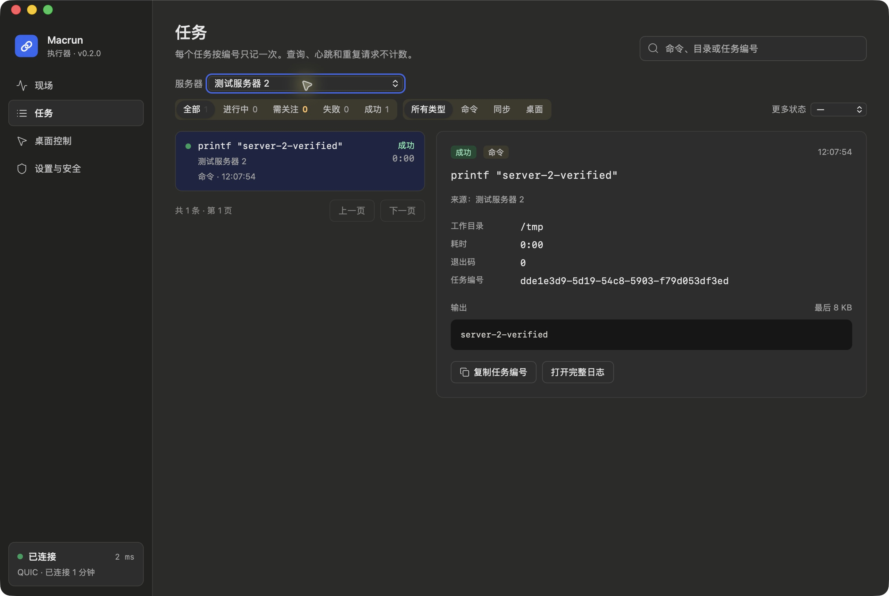

# 多对多连接复查

2026-10-05。沿用现有界面和原生面板，增加多服务器连接管理与任务来源识别。

## 已验证

- 两个真实本地 QUIC 服务端、两个客户端：客户端一同时连接两台服务器；服务器一同时连接两个客户端。
- 多客户端必须显式选择目标，未选择时返回 `client_required`；错误类型的选择参数被拒绝。原有单客户端默认路由保留。
- 两个客户端通过同一服务器并发同步，分别得到正确文件和独立任务结果。
- 两台服务器使用同一个请求 UUID，各执行一次；重试不重复执行，记录不能跨连接混用。原 UUID 在同一来源连接仍可查询，返回的任务 UUID 可用于正常轮询。
- 本机合并历史的分页、筛选、详情来源正确；130 条记录的同时间分页测试没有遗漏或重复。
- 全部停止覆盖所有连接；服务器故障及启动时 DNS 失败不影响其他连接。重启保持客户端身份和去重记录。
- 两个独立后端进程竞争同一个模拟桌面资源的回归测试通过，桌面调用不重叠。
- 真实 Tauri 测试应用中，两台服务器均显示已连接；任务来源与输出正确，服务器筛选只保留对应任务。断开后显示 `0/2 在线`，两项均未连接；重连恢复 `2/2 在线` 和历史记录。
- 添加页明确保留现有服务器及记录；运行时禁用添加和移除，停止后可操作。移除附加连接后，其历史文件仍在。
- 实测修正深色模式分隔线过亮、窄侧栏在线数量挤占延迟文字、断开后残留旧连接状态三处问题。

## 自动化与构建

43 项核心 Rust 测试、24 项桌面 Rust 测试、17 项前端模型／样式检查和 93 项组件测试通过（共 177）。核心及桌面 clippy 拒绝警告检查通过；前端、debug 与 release 应用构建通过。

`scripts/multi-smoke.py`、原有 `scripts/smoke.py` 和 `scripts/desktop-smoke.py` 均通过。它们分别覆盖多对多、单连接兼容和桌面私有 IPC，使用独立临时数据。

## 截图

两台服务器的连接列表与紧凑侧栏状态（最终构建）：

服务器筛选、来源和详情（首次真实窗口检查，后续另修正在线数量和侧栏排版）：

## 验证边界

原生菜单面板的多服务器数量和任务来源有模型测试，全局暂停／停止有真实 IPC 验证。本轮未取得菜单栏弹出面板的独立截图。没有以模拟 MCP 图片声称完成真实桌面截图或点击验收；本轮只验证多连接桌面调用互斥，原有实际后端的权限与视觉验收见此前记录。

同时连接上限为 16；编辑连接前须等待活动任务完成并断开，不提供运行中热添加。移除不会清理钥匙串或历史。客户端仍是受信任的同用户执行环境，不构成跨用户权限隔离。
