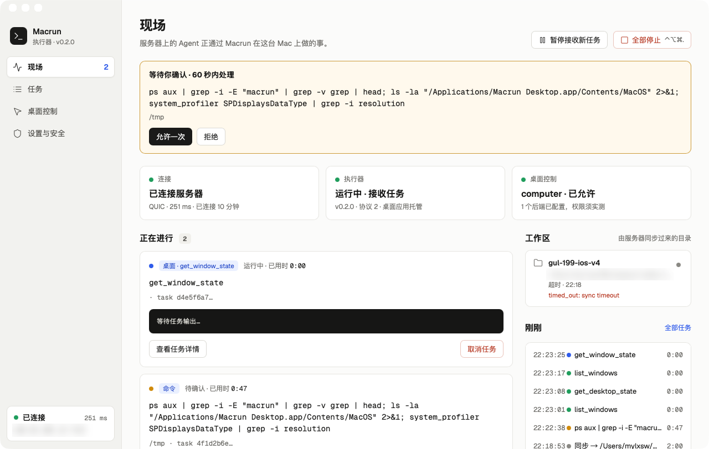
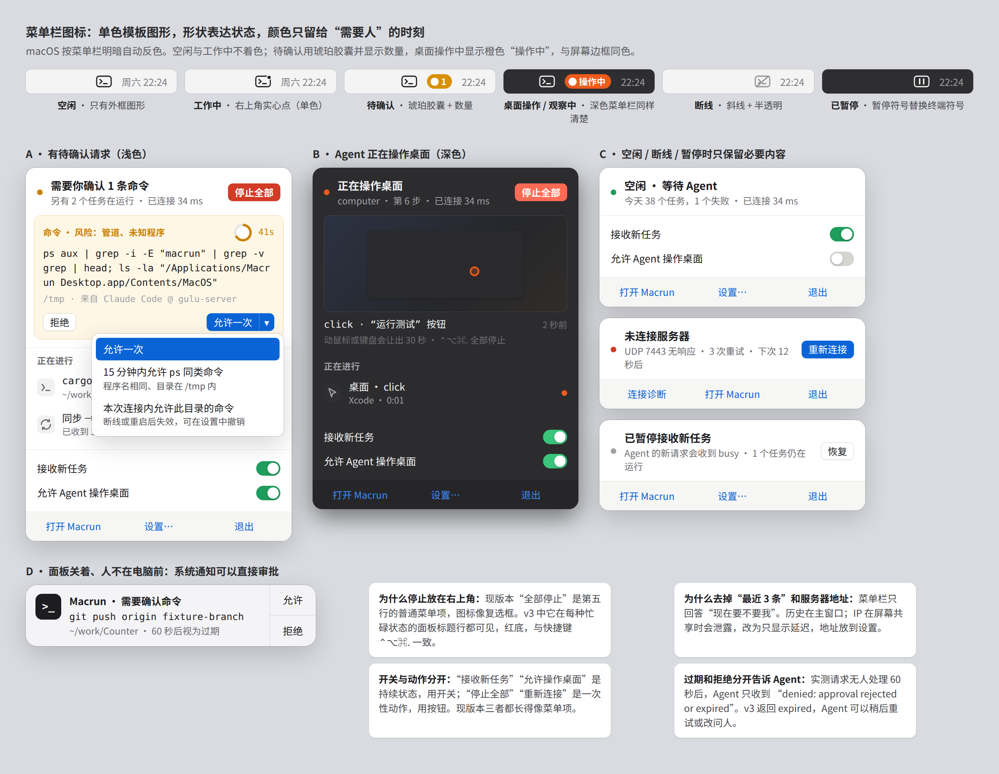
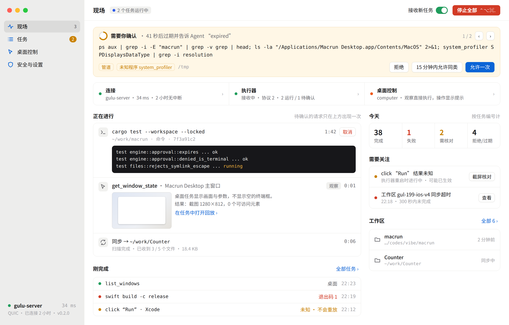
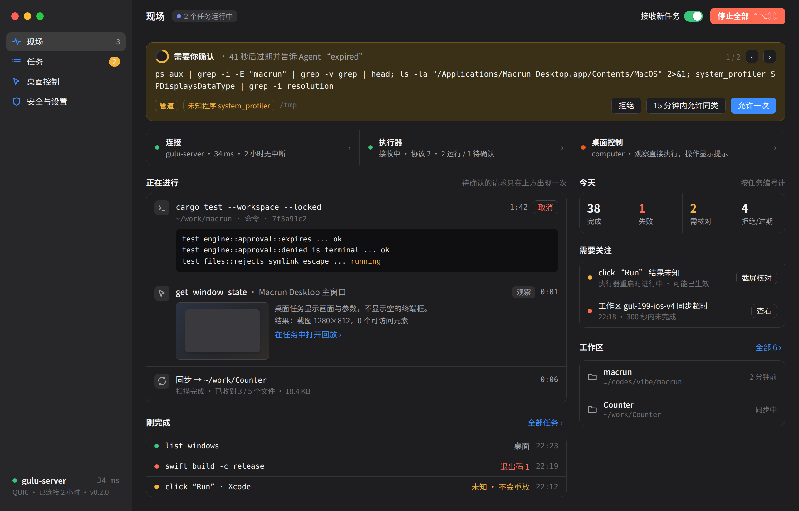
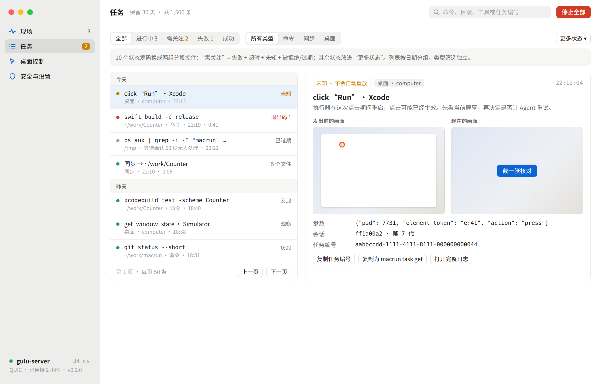
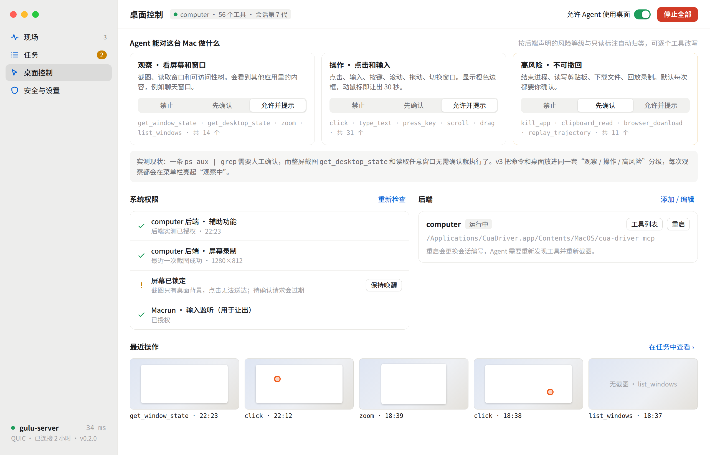

# 桌面端 UI 与功能重新评估 · v3 设计稿

状态：设计提案，在 v2 的基础上修订，尚未实现。记录日期：2026-10-04。

v2 已经回答了“看得见、停得住、管得住”。v3 不推翻信息架构，只处理实际使用中暴露的问题：菜单栏像网页而不像 macOS，审批容易在人不在时悄悄失败，桌面截图的风险反而比一条 `ps` 命令管得更松，主窗口同一件事重复出现三次。

## 1. 现状验证

验证方式：2026-10-04 22:23，通过 macrun 连接用户 Mac 上已安装的 release 版 `/Applications/Macrun Desktop.app`（执行器 v0.2.0，桌面应用托管）。用 computer 后端读取窗口并截图，同时向执行器提交一条普通的只读命令，观察审批流程。菜单栏面板没能实时打开，因为当时 Mac 处于锁屏状态，整屏截图只有桌面背景，`loginwindow` 在最前。菜单栏部分的结论来自源码（`desktop/src-tauri/src/main.rs`、`desktop/src/style.css`）以及仓库里最新的原生截图 `ui-review/images/quality/menubar.png`。



### 发现

| # | 问题 | 证据 | 影响 |
| --- | --- | --- | --- |
| 1 | 审批只在应用内显示，人不在时静默过期；Agent 区分不了“被拒绝”和“过期” | 实测：提交 `ps aux \| grep …` 后进入 `awaiting_approval`，60 秒后变为 `denied`，错误为 `denied: approval rejected or expired`。系统通知只在 failed / unknown / timed_out 时发送（`desktop/src/main.tsx` 的 notifications 效果），等待确认时不会通知 | 远程 Agent 卡住 60 秒后失败，也不知道该稍后重试还是换个做法 |
| 2 | 审批只有“允许一次” | 实机截图 | Agent 连续执行同类命令时，每一条都要点一次 |
| 3 | 命令与桌面的风险等级倒挂 | 同一时段，只读的 `ps` 需要确认，`get_desktop_state` 整屏截图和 `get_window_state` 读取窗口都没有确认就执行了。`src/engine.rs` 中审批只覆盖 `exec.start`，`mcp.call` 只检查桌面总开关 | 截图能看到微信、Telegram 等其他应用的内容，隐私风险比 `ps` 高 |
| 4 | 同一个待确认请求出现三次 | 顶部审批卡、“正在进行”卡片（待确认 · 已用时 0:47）、“刚刚”列表 | 干扰视线，看起来像三件事 |
| 5 | 桌面任务套用命令任务的卡片 | `get_window_state` 卡片显示空的黑色终端框“等待任务输出…”，元信息只剩 `· task d4e5f6a7…`，开头多一个点 | 桌面操作最该看的是画面和参数，这两样都没有 |
| 6 | 连接状态重复两处，并显示服务器 IP | 侧栏底部和“连接”卡片；菜单栏面板标题副行也带 `IP:7443` | 屏幕共享或录屏时泄露地址 |
| 7 | 工作区区域突出显示一条陈旧的失败记录 | `gul-199-ios-v4 · 超时 · timed_out: sync timeout`，直接显示原始错误码，路径被截断 | 一条旧故障占据首屏右栏 |
| 8 | 菜单栏图标是彩色位图，不是模板图像 | `tray_image()` 逐像素画出 52×44 位图，`icon_as_template(false)`；深浅色依据主窗口主题判断，而不是菜单栏的实际外观；空闲时也一直亮绿点 | 菜单栏着色或使用深色壁纸时图形可能看不清；常亮的颜色不符合 macOS 习惯 |
| 9 | 菜单栏面板是自绘网页窗口 | 352 宽、无边框、透明的 WebviewWindow，手动定位，失焦隐藏；没有系统材质 | 观感像网页弹层；“全部停止”是第五行普通菜单项，方框图标像复选框 |
| 10 | 面板中开关和动作长得一样 | “暂停接收新任务”“全部停止”“允许桌面控制 ✓”都是菜单项样式 | 看不出哪个是持续状态，哪个是一次性动作 |
| 11 | 没有深色模式，字体是网页字体 | CSS 中没有 `prefers-color-scheme`；正文使用 Geist | 在深色系统中格格不入，不像原生应用 |
| 12 | 任务页有 10 个状态筹码 | `ui-review/images/quality/tasks-page-2.png` | 横向排满一行，最常用的“需要关注”反而要逐个点 |
| 13 | 桌面控制页“最近操作”是灰色占位块 | `ui-review/images/quality/desktop.png`，四个“查看操作记录”占位块 | 看起来像图片加载失败 |
| 14 | 锁屏时界面不提示 | 锁屏期间桌面状态仍显示“已允许”，截图只得到桌面背景，审批无人处理 | 用户和 Agent 都不知道这台 Mac 当前无法完成桌面任务 |

做得好的地方会保留：三条独立状态、`unknown` 不重放、暂停与全部停止分离、任务分页与按需读取、审批卡放在页面顶部。

## 2. v3 设计目标

1. **菜单栏优先。** 大多数时候用户只看菜单栏。它只回答一件事：现在需不需要我。
2. **人不在也能审批，等不到就明确说清楚。** 审批可以通过系统通知完成；超时返回 `expired`，不再和“拒绝”混在一起。
3. **命令和桌面使用同一套风险分级。** 观察、操作、高风险三档，截图不再免检。
4. **一件事只出现一次。** 待确认的请求只在审批区出现；每种任务类型用适合它的卡片。
5. **像 Mac 应用。** 模板图标、系统材质、系统字体、深色模式。

## 3. 菜单栏



**图标。** 改为单色模板图像（`icon_as_template(true)`），由 macOS 按菜单栏明暗自动反色。状态靠形状区分：空闲是外框，工作中加实心点，断线加斜线并半透明，暂停换成暂停符号。只有两种情况使用颜色，并在图标旁显示文字胶囊：待确认（琥珀色加数量）、桌面操作或观察中（橙色“操作中”，与屏幕边框同色，类似系统麦克风指示）。不再根据主窗口主题判断深浅。

**面板结构**（宽 330，从上到下）：

1. 标题行：一句话状态，副行显示任务数和延迟，不显示 IP。只要有任务在跑，右侧就有红色“停止全部”。
2. 审批区：命令最多显示三行、风险原因、目录与来源、倒计时圆环。拒绝在左，允许是一个分段按钮：允许一次 / 15 分钟内允许同类命令 / 本次连接内允许此目录。多条待确认时可翻页。
3. 正在进行：最多 3 行，按类型显示图标。桌面操作显示最近一帧画面和点击位置。
4. 两个开关：接收新任务、允许 Agent 操作桌面。
5. 底栏：打开 Macrun、设置、退出。

“最近 3 条”移到主窗口。空闲、断线、暂停时面板收缩为一行状态加一个主操作。

**系统通知审批。** 面板关闭时，待确认请求发出带“允许 / 拒绝”按钮的系统通知。

## 4. 主窗口

### 现场





- 工具栏统一放置：页面标题、运行摘要、接收任务开关、停止全部（含快捷键）。每一页都有，不只在现场页。
- 审批区放在最上方，待确认的请求不再出现在“正在进行”和“刚完成”里；同时显示过期后会告诉 Agent `expired`。
- 三条状态压缩为一行三段，点击跳到对应页面。侧栏底部只保留服务器名称和延迟，地址放在设置和悬停提示中。
- “正在进行”的卡片按类型区分：命令显示输出尾部；桌面操作显示画面缩略图、目标窗口和结果摘要，不显示空终端；同步显示阶段和文件数（仍不画百分比）。
- 右栏改为“今天”统计、“需要关注”（未知结果、同步失败，各带一个处理入口）和工作区。陈旧失败不再占据首屏位置，原始错误码改写成可读文字。

### 任务



- 10 个状态筹码改为两组分段控件：状态（全部 / 进行中 / 需关注 / 失败 / 成功）和类型（命令 / 同步 / 桌面）。其余状态放进“更多状态”。“需关注”包含失败、超时、未知、被拒绝和过期。
- 列表按日期分组；过期和拒绝分开显示，并说明原因（例如“等待确认 60 秒无人处理”）。
- 桌面任务详情并排显示“发出前的画面”和“现在的画面”，点击位置用标记显示；`unknown` 提供“截一张核对”。

### 桌面控制



- 页面以“Agent 能对这台 Mac 做什么”开头，分为三档，每档可选禁止 / 先确认 / 允许并提示。
  - **观察**：截图、读取窗口和可访问性树，默认允许并提示。
  - **操作**：点击、输入、滚动、拖动，默认允许并提示，显示橙色边框，用户动鼠标时让出。
  - **高风险**：结束进程、读写剪贴板、下载文件、回放录制，默认先确认。
- 分级默认依据后端在 `tools/list` 中声明的 `annotations`（readOnlyHint / destructiveHint）和 cua-driver 提供的 `risk.class`，允许按单个工具覆盖。画板中的分类和工具数量仅作示意，实施时以实际工具列表为准。
- 权限区分开显示“后端实测”和“Macrun 自身”两类，并新增“屏幕已锁定”检查。
- 最近操作显示真实缩略图；没有截图的调用明确写“无截图”，不使用占位块。

### 安全与设置

结构沿用 v2，新增“已授予的临时允许”列表（同类命令、目录），显示剩余时间，可单独撤销；审批超时可选 60 秒 / 5 分钟。

## 5. 视觉系统

- 字体使用系统字体（SF Pro / 苹方），命令和路径使用 SF Mono。去掉 Geist 网页字体。
- 颜色写成语义变量，同时提供浅色与深色两套，跟随 `prefers-color-scheme`。终端块在两种模式下都是最深的元素。
- 主窗口侧栏和菜单栏面板使用系统材质：Tauri 2.12 的 `WebviewWindowBuilder::effects`，侧栏用 `Sidebar`，面板用 `Popover` 或 `Menu`。
- 状态色只表示状态，不同状态同时拉开明度。橙色专用于“Agent 正在操作 / 观察屏幕”。
- 按钮高度 26，使用 0.5 像素描边，更接近 AppKit 的控件密度。

## 6. 实施清单

| 优先级 | 改动 | 涉及位置 | 是否需要改核心 |
| --- | --- | --- | --- |
| P0 | 审批超时返回 `expired` 终态（或 `denied` 加上 `reason: expired`），与用户拒绝区分；Skill 文档同步说明 | `src/engine.rs` 审批分支、`skills/` | 是 |
| P0 | 待确认时发送系统通知；支持带“允许 / 拒绝”按钮的可操作通知 | `desktop/src/main.tsx`；可操作通知需要在 `platform.m` 中使用 `UNUserNotificationCenter` 注册 category（`tauri-plugin-notification` 在桌面端不支持按钮） | 否 |
| P0 | 菜单栏图标改为模板图像，按状态切换形状；只有待确认 / 操作中使用彩色胶囊（可用 `set_title` 或独立图像） | `desktop/src-tauri/src/main.rs` `tray_image` / `tray_status` | 否 |
| P0 | 菜单栏面板按第 3 节重排：停止放到标题行，开关与动作分开，去掉 IP 和“最近 3 条” | `desktop/src/main.tsx` 托盘组件、`style.css` | 否 |
| P0 | 现场页去重：待确认请求只出现在审批区；桌面任务卡片显示画面与参数，不显示空终端 | `desktop/src/main.tsx`、`Features.tsx` | 否 |
| P0 | `mcp.call` 纳入审批：按观察 / 操作 / 高风险分级，默认高风险先确认；每次观察都在菜单栏显示提示 | `src/engine.rs`、`src/safety.rs`、桌面控制页 | 是 |
| P1 | 临时允许规则（同类命令 15 分钟、本次连接内允许某目录），可在设置中查看和撤销 | `src/safety.rs`、设置页 | 是 |
| P1 | 深色模式、系统字体、侧栏与面板材质 | `style.css`、`features.css`、`main.rs` | 否 |
| P1 | 任务页筛选改为两组分段控件、按日期分组、桌面任务前后画面对比 | `taskHistory.ts`、任务组件 | 否 |
| P1 | 锁屏检测：桌面状态显示“屏幕已锁定”，提示 Agent 桌面任务会失败 | `native.rs` / `platform.m`（CGSession 字典） | 否 |
| P2 | 工作区“需要关注”聚合、陈旧失败折叠 | 现场页 | 否 |
| P2 | 审批超时时长可配置 | `src/engine.rs`、设置页 | 是 |

每项实现时按仓库惯例补充前端组件测试与 Rust 单元测试；视觉变更用 `desktop/tests/visual.ts` 夹具截图核对。

## 7. 待确认问题

1. `expired` 作为新的终态，还是保留 `denied` 并加 `reason` 字段？前者对 Agent 更清楚，后者对现有客户端兼容性更好。
2. 观察类桌面调用默认“允许并提示”还是“先确认”？前者不打断工作流，后者更保守。
3. “15 分钟内允许同类命令”的“同类”如何界定：本设计按“程序名相同且目录在同一允许范围内”，是否需要更严格（完整命令相同）？
4. 菜单栏面板是否改用原生 `NSPopover` 托管 WebView？这样能获得箭头和系统动画，但需要更多原生代码。本设计先用 Tauri 的 `Popover` 材质达到大部分效果。

## 文件

- `mockups/`：静态 HTML 画板（`menubar.html`、`main.html`，加 `#dark` 为深色、`tasks.html`、`desktop.html`）以及共享样式。只用于设计评审，不是产品代码。
- `images/`：由画板渲染的 2× 截图，以及实机现场页截图（已模糊地址）。

重新生成截图：

```sh
cd docs/desktop/redesign-v3/mockups
google-chrome --headless=new --hide-scrollbars --force-device-scale-factor=2 \
  --window-size=1280,820 --screenshot=../images/main.png "file://$PWD/main.html"
# menubar.html 使用 --window-size=1240,960
```
