# 桌面端 UI 重新设计 · v4 设计稿

状态：已按本稿实现（第 10 节记录实现情况与偏差）。记录日期：2026-10-05。依据是 v3 实施后的实机截图（GUL-211 附件，含服务器地址和证书指纹，因此不放进仓库）和 `desktop/src` 的源码。

v2 解决了“看得见、停得住、管得住”，v3 把审批、分级和菜单栏做成了原生的样子。v4 换个出发点：**用户打开 Macrun 时想知道什么**。现在的界面按工程模块组织，每个模块都很完整，但用户要自己拼出答案。v4 按用户的问题重新组织页面。

## 1. 用户是谁，他关心什么

Macrun 的用户把 Claude Code、Codex 等 Agent 放在服务器上，把自己的 Mac 当作执行机。他通常不盯着 Macrun，Agent 在另一个窗口里工作。按出现频率，他想知道的是：

| 频率 | 用户的问题 | 理想的回答方式 |
| --- | --- | --- |
| 每天几十次，看一眼 | 它在干活吗？正常吗？ | 菜单栏图标形状，一眼就懂 |
| 每天几次 | 需要我做什么吗？ | 主动弹出，不用找 |
| 每天几次 | Agent 在我 Mac 上做到哪一步了？ | 按**项目**说，而不是按 shell 命令说 |
| 偶尔 | 刚才那次失败是 Agent 的问题还是 Macrun 的问题？ | 两类问题分开显示，Macrun 的问题附带原因和处理办法 |
| 偶尔 | 让它停下 | 任何地方一个按钮或一个快捷键 |
| 很少 | 配置、修复：配对、权限、后端、规则 | 检查清单：哪一步没好、点哪里修 |

他**不关心**的内容：协议版本、QUIC、会话编号、证书指纹、工具数量、后端可执行路径、几千条历史任务的分页。这些在排错时需要，但不应占据首屏。

## 2. 现状问题（从用户角度）

| # | 位置 | 现象 | 对用户的影响 |
| --- | --- | --- | --- |
| 1 | 现场 | 卡片标题是原始 shell，最长占 6 行（`swift build 2>&1 \| grep -E … \| cut -c1-200 \| tail -12`） | 看不出 Agent 在做什么，第二张卡片就被挤出首屏 |
| 2 | 现场 | 首屏最显眼的是“连接 / 执行器 / 桌面控制”三张卡，正常时内容全是“已连接、运行中、已允许” | 宝贵的位置一直在说“没事” |
| 3 | 现场 | 输出区是一个大黑框，只有 1～2 行内容；每张卡片都带“在终端打开目录” | 信息少，重复操作多 |
| 4 | 现场 | 右栏“工作区”：`/tmp/...` 被截断，一条昨晚的 `timed_out: sync timeout` 排在第一，每行一个绿点，底部“已显示 6 / 9” | 用户不会对工作区做任何操作，却要读它 |
| 5 | 任务 | “需关注 167、失败 158”。核心把所有退出码非零的命令记为 `failed`（`src/engine.rs` 约 867 行），`src/history.rs` 再把 `failed` 归入“需关注” | Agent 用 `grep` 探测时退出 1 很正常，结果把真正的 Macrun 问题淹没了，告警失去意义 |
| 6 | 任务 | 1777 条平铺列表，每页 50 条；相邻的 `P=$PWD; TB="$P/.build/out/Produc…` 无法区分 | 找不到“GUL-207 那次构建”这样的单元 |
| 7 | 桌面控制 | 一页里混着策略（三档）、后端工程细节（会话、工具、路径、重启）、Macrun 自身权限及两段说明、操作偏好 | 回答不了最直接的问题：桌面控制现在能用吗？ |
| 8 | 设置与安全 | 命令规则在这里，桌面规则在另一页；服务器 IP 和证书指纹在首屏；多服务器入口在页面底部 | 想知道“Agent 能做什么”要看两个页面；录屏会泄露地址 |
| 9 | 菜单栏 | 命令从中间截断（`ls -d /tmp/typeflux-gu…p/typeflux-gul207/type`），标题固定为“Agent 正在工作” | 截断后的文字没有意义；看不出是哪个项目 |
| 10 | 全局 | 文案使用“执行器、协议 2、桌面应用托管、后端、会话”等工程术语 | 新用户需要先学一套词汇 |

## 3. 设计原则

1. **以项目为单位，不以命令为单位。** Agent 的一次工作在一个目录里执行十几条命令，用户的记忆单位是“typeflux 那个任务”。界面按项目归组；每个项目只突出当前这一步。
2. **正常时安静，异常时显眼。** 健康状态正常时只占一行；出问题时排到最上面，并且自带修复按钮。
3. **分开 Agent 的事和 Macrun 的事。** 退出码非零属于 Agent 的工作结果，用中性灰色显示，不计入问题。超时、结果未知、同步失败、拒绝、过期、断线、缺少权限才是“需要关注”。
4. **先给人话，原文随时可取。** 命令先显示提炼出的主要程序（`swift build → swift test`），原始命令在详情中显示，可一键复制。
5. **一件事只在一个地方管。** 所有“Agent 能做什么”集中在“权限”页；所有“这台 Mac 准备好了吗”集中在“本机”页。
6. **工程细节放进二级内容。** 会话、工具列表、路径、证书、协议版本放在“技术详情”和“···”菜单里，不删除，排错时仍能找到。

## 4. 信息架构

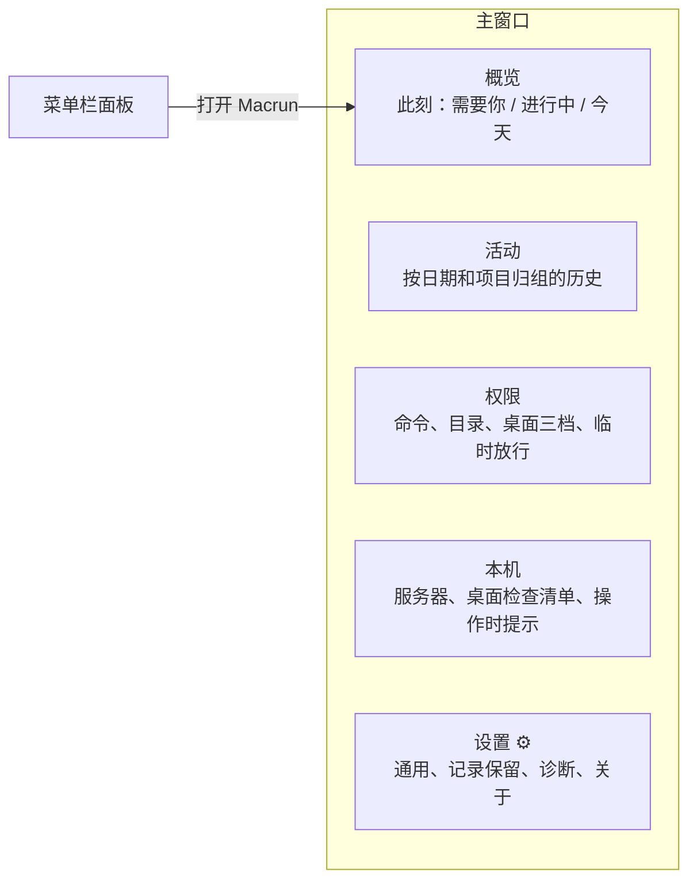

| v3 位置 | v4 位置 |
| --- | --- |
| 现场 · 三张状态卡 | 概览右上角一个健康胶囊，正常时一行；侧栏底部列出服务器 |
| 现场 · 正在进行 | 概览 · 进行中（按项目归组） |
| 现场 · 工作区 | 概览 · 最近完成（按项目）；完整内容在活动页 |
| 任务 | 活动 |
| 桌面控制 · 三档策略 | 权限 · 桌面 |
| 桌面控制 · 后端、Macrun 自身权限 | 本机 · 桌面控制检查（技术细节折叠） |
| 桌面控制 · 操作时、防休眠 | 本机 · Agent 操作桌面时 |
| 设置与安全 · 安全边界 | 权限 · 命令与文件、保护 |
| 设置与安全 · 连接、服务器连接 | 本机 · 服务器（地址和指纹在“···”中） |
| 设置与安全 · 通用、诊断、记录管理 | 设置（侧栏底部齿轮） |

## 5. 菜单栏

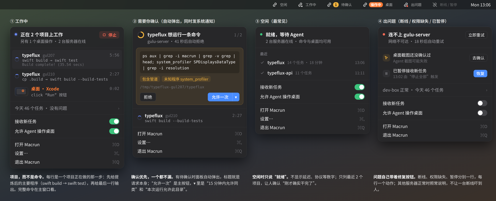

浅色：[menubar-light.png](images/menubar-light.png)

**图标**沿用 v3 的单色模板图像和形状区分，新增“出问题”状态（右下角红点）。只有“待确认”和“操作桌面中”使用彩色胶囊。

**面板**宽 340，从上到下：

1. **标题行是一句结论**：“正在 2 个项目上工作”“typeflux 想运行一条命令”“就绪，等待 Agent”“连不上 gulu-server”。副行只放用户关心的数字。右侧放与当前状态对应的唯一主操作：停止、立即重试或恢复。
2. **待确认**：有请求时面板自动弹出，同时发送系统通知；标题就是请求本身。“允许一次”是主按钮，▾ 中有“15 分钟内允许同类”和“本次运行允许此目录”。命令完整显示（最多 3 行，超过时可滚动），不再从中间截断。
3. **进行中**：每个项目一行，依次显示项目名、来源标签（例如 `gul207`）、用时、提炼后的步骤和最后一行输出。桌面操作显示缩略图和动作，用橙色标出。最多 3 行，其余收进“还有 N 个”。
4. **今天**：一行汇总，“今天 46 个任务 · 没有问题”，点击打开活动页。
5. **两个开关**：接收新任务、允许 Agent 操作桌面（不变）。
6. **菜单行**：打开 Macrun ⌘O、设置… ⌘,、退出 Macrun ⌘Q。采用原生菜单的样式和快捷键，不使用三个网页按钮。

空闲时只说“就绪”，加上最近 2 个项目，让用户确认刚才的工作确实结束了。出问题时每个问题一行，每行带一个修复动作；其他服务器正常时也照常写出来，避免一台断线让人以为全部失效。

## 6. 主窗口

侧栏只有四项：**概览、活动、权限、本机**。底部列出服务器（状态点和延迟）和“设置”。侧栏角标只用于需要用户处理的事项，例如待确认数量、本机待完成的检查项。

### 6.1 概览

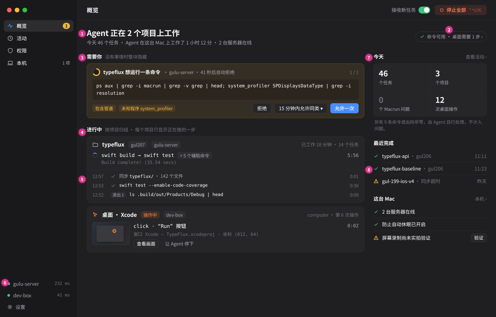

浅色：[overview-light.png](images/overview-light.png)

1. **一句话状态**：“Agent 正在 2 个项目上工作”，副行显示今天的任务数、工作时长和在线服务器数。
2. **健康胶囊**：“命令可用 · 桌面需要 1 步 ›”，替代三张状态卡；全部正常时显示“一切就绪”，点击进入本机页。
3. **需要你**：只放必须由人处理的事项，包括待确认请求和 Macrun 层面的问题（例如同步超时、权限缺失）。没有事项时整块隐藏。待确认请求只在这里出现一次（沿用 v3）。
4. **进行中按项目归组**：每个项目一张卡片，标题包括项目名、来源标签、服务器以及“已工作 18 分钟 · 14 个任务”。正文只突出当前这一步：提炼后的步骤、计时、最后一行输出。辅助命令（ls、cp、grep、tail…）折叠为“+5 个辅助命令”。
5. **最近几步**：卡片下方显示最近 3 步，帮助判断进度。退出码非零显示为灰色“退出 1”，不使用红色。
6. 侧栏底部用服务器列表代替“已连接”卡片，不显示 IP。
7. **今天**：任务数、项目数、Macrun 问题数、桌面操作数。下方一行注明“另有 9 条命令退出码非零，由 Agent 自行处理”，既不隐瞒，也不制造告警。
8. **最近完成**和**这台 Mac** 两个小列表，各自带一个跳转入口。陈旧的失败只占一行，并改写成可读文字（例如“同步超时”）。

桌面操作卡片（橙色）显示缩略图、动作、目标窗口、坐标，并提供“查看画面”和“让 Agent 停下”。

### 6.2 活动

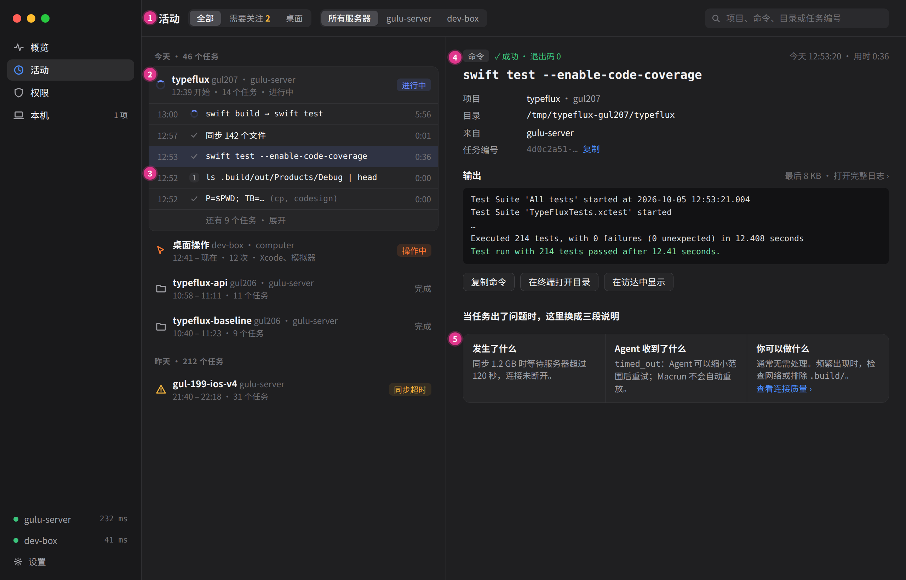

1. 顶部用两组分段控件替代 10 个筹码：**全部 / 需要关注 / 桌面**，以及服务器。搜索框覆盖项目、命令、目录和任务编号。
2. 列表**按日期 → 项目会话**两级归组：同一项目（同一工作区根目录、同一服务器）在 30 分钟内的连续任务归为一次会话，标题显示时间范围、任务数，以及进行中、完成或同步超时等状态。用滚动和分组折叠代替“上一页 / 下一页”。
3. 会话展开后每行包含时间、状态、提炼后的步骤和用时。退出码非零用灰色小标表示，不进入“需要关注”。
4. 详情：顶部显示类型、结果、退出码；标题是完整命令；下面是项目、目录、来源和任务编号（可复制）；然后是输出（最后 8 KB）以及复制命令、在终端打开目录、在访达中显示。
5. **出问题的任务改为三段说明**：发生了什么、Agent 收到了什么（错误码及其含义）、你可以做什么，不直接显示 `timed_out: sync timeout` 这样的原始错误码。

### 6.3 权限

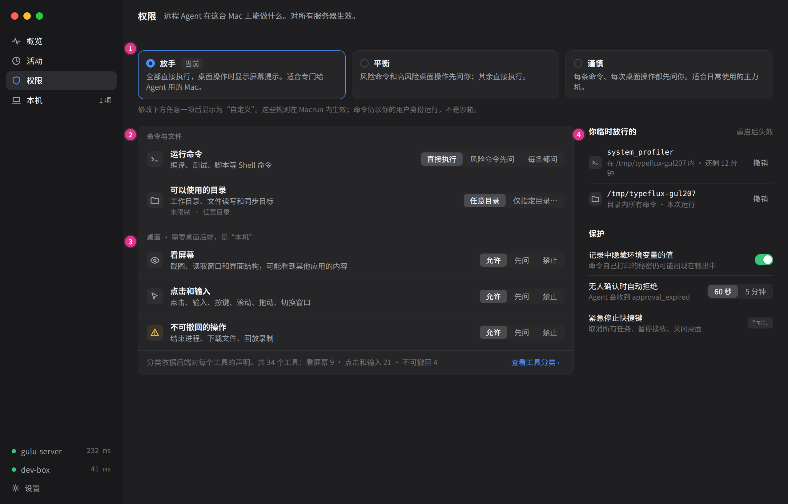

1. **三个预设**：放手（当前一期默认）、平衡、谨慎。用户先选一个合适的起点，修改任意一项后显示为“自定义”。下方一行写明边界：规则在 Macrun 内生效，命令仍以你的用户身份运行，不是沙箱。
2. **命令与文件**：运行命令（直接执行 / 风险命令先问 / 每条都问）和可以使用的目录（任意目录 / 仅指定目录）。
3. **桌面三档**改用动作名称：看屏幕、点击和输入、不可撤回的操作。每档都写明“可能看到其他应用的内容”这类后果。底部注明分类依据和各档工具数，可展开查看工具分类。
4. **你临时放行的**：审批中给出的临时允许，显示剩余时间，可单独撤销。**保护**：隐藏环境变量值、无人确认时自动拒绝的时长、紧急停止快捷键。

### 6.4 本机

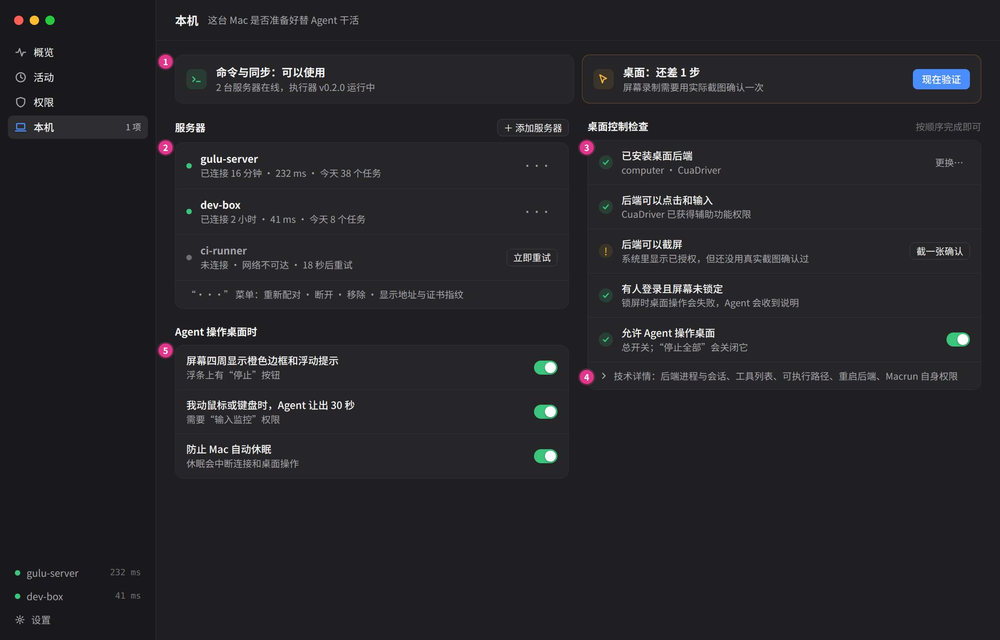

1. **两张就绪卡**分别回答“命令与同步能用吗”和“桌面能用吗”。没就绪时直接给出下一步按钮，例如“现在验证”。
2. **服务器列表**：名称、连接时长、延迟、今日任务数。断开的服务器显示原因和重试倒计时。重新配对、断开、移除、显示地址与证书指纹收进“···”菜单；“添加服务器”放在标题右侧，不再藏在页面底部。
3. **桌面控制检查清单**：按顺序检查已安装后端、后端可以点击和输入、后端可以截屏（真实截图验证）、有人登录且屏幕未锁定、总开关。每项为 ✓ 或 !，未完成的项带一个修复按钮。现在用两段文字解释的“Macrun 自身权限不等于后端权限”，改由清单直接检查后端本身。
4. **技术详情**折叠：后端进程与会话、工具列表、可执行路径、重启后端、Macrun 自身权限。
5. **Agent 操作桌面时**：屏幕边框和浮条、让出 30 秒、防止休眠，三个开关。

### 6.5 设置（齿轮）

不出新画板。内容为通用（登录时启动、关闭窗口后留在菜单栏、启动时自动连接、通知）、记录（保留 7 / 30 / 90 天、立即清理）、诊断（导出）和关于（版本、协议）。这些项目都是低频的。

## 7. 视觉系统调整

- **默认深色**，与当前使用习惯一致；浅色由同一套语义变量生成，沿用 `scripts/dark-theme.mjs` 的思路，方向反过来。
- **颜色只表示状态**：蓝色表示进行中，琥珀色表示需要你，红色表示 Macrun 问题或停止，橙色专用于桌面操作中，绿色只用在健康检查的 ✓ 和开关上。成功是默认状态，不再给每一行加绿点。
- **减少嵌套边框**：只有项目卡片和分组列表有边框，分区靠标题和间距区分，不再框中套框。
- **字号层级**：一句话状态 20、分区标题 13 粗体、正文 13、元信息 12、代码 11.5～12 等宽。
- **按钮**：每个区域最多一个主按钮。“停止全部”使用红色淡底，平时不抢视线，但一眼能找到。

## 8. 实施清单

| 优先级 | 改动 | 涉及位置 | 是否改核心 |
| --- | --- | --- | --- |
| P0 | 区分“退出码非零”和“Macrun 失败”：状态仍为 `failed`，前端按 `result.exit_code ≠ 0` 且没有 `error.code` 判断，显示为灰色“退出 N”；`history.rs` 的 `attention` 组排除这类任务，今日统计单独计数 | `src/history.rs`、`desktop/src/taskHistory.ts`、`main.tsx` | 是（筛选组，兼容现有状态值） |
| P0 | 步骤提炼：按 `;`、`&&`、`\|\|`、`\|` 拆分命令，去掉 `cd/ls/cp/echo/grep/tail/head/cut/sed/cat` 等辅助程序后得到主程序序列，全部是辅助程序时退回第一个；`env`、`sudo`、`P=...` 前缀跳过 | `desktop/src/taskHistory.ts`（纯函数，补单元测试） | 否 |
| P0 | 项目归组：按工作区根目录（`snapshot.workspaces`，取最长前缀）加服务器归组，没有匹配时使用 `cwd`；项目名取目录名，来源标签取上一级目录中的区分片段（例如 `gul207`） | `taskHistory.ts`、概览组件 | 否 |
| P0 | 菜单栏面板按第 5 节重写：结论式标题、项目行、今天汇总、菜单行和快捷键；待确认时自动弹出 | `main.tsx` 托盘分支、`style.css`、`src-tauri/src/main.rs`（弹出） | 否 |
| P0 | 概览页：去掉三张状态卡，改为健康胶囊；进行中按项目归组；右栏改为今天、最近完成、这台 Mac | `main.tsx`、`Features.tsx` | 否 |
| P1 | 侧栏改为概览 / 活动 / 权限 / 本机 + 底部服务器与设置；拆分 `SettingsPage` 和桌面控制页的内容 | `main.tsx`、`SettingsPage.tsx`、`Features.tsx` | 否 |
| P1 | 权限页：预设三档（根据现有设置推算当前预设）；命令、目录、桌面三档放在同一页 | `Features.tsx`（`SafetyPanel`、`DesktopTiers`、`AllowRules`） | 否 |
| P1 | 本机页：就绪卡与桌面检查清单（复用现有权限探测和后端实拍），技术详情折叠 | `Features.tsx`（`BackendPanel`） | 否 |
| P1 | 活动页：按日期和项目会话归组、滚动加载、问题任务三段说明（错误码对照表） | `taskHistory.ts`、任务组件 | 否 |
| P2 | 锁屏检测（v3 遗留），接入桌面检查清单 | `native.rs` / `platform.m` | 否 |
| P2 | 审批超时时长可选 60 秒 / 5 分钟（v3 遗留） | `src/engine.rs`、权限页 | 是 |
| P2 | 系统通知中直接“允许 / 拒绝”（v3 遗留） | `platform.m` | 否 |

按仓库惯例，每项实现都补充组件测试（`desktop/tests`）和 Rust 单元测试；提炼和归组这两个纯函数单独测试，覆盖率要求高于 80%。视觉变更用 `desktop/tests/visual.ts` 夹具截图，与本稿对照。

## 9. 待确认问题

1. **项目会话的切分**：同一项目 30 分钟内无新任务即视为新会话，是否合适？是否需要 Agent 侧在请求中携带会话或议题标识（例如 `GUL-207`），以获得更准确的分组？后者要扩展协议，本稿先用目录推断。
2. **退出码非零是否完全不计入“需要关注”**：本稿将其视为 Agent 的正常工作结果。少数用户可能希望看到“测试失败”这一类结果，可以在活动页增加“含非零退出”筛选。
3. **默认预设**：一期保持“放手”。正式发布时是否改为“平衡”？
4. **本机页名称**：“本机”“这台 Mac”“准备情况”三选一。本稿用“本机”，因为侧栏需要两个字的短名称。

## 10. 实施记录

用户确认“按这个方案执行，尽可能还原”。第 9 节的待确认问题按本稿默认值处理：

| 问题 | 决定 |
| --- | --- |
| 项目会话切分 | 按目录推断：最长匹配的同步工作区根目录 + 服务器；30 分钟无活动切分新会话。不扩展协议 |
| 退出码非零 | 不计入“需要关注”；活动页“更多筛选 → 失败”仍可查看全部失败记录，概览注明非零退出数量 |
| 默认预设 | 保持“放手”（新安装默认值不变） |
| 页面名称 | 本机 |

### 实现截图（真实组件 + 浏览器视觉夹具 `?scenario=v4`）

| 概览 | 活动 |
| --- | --- |
| 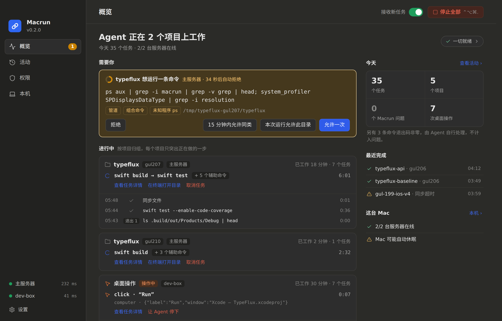 | 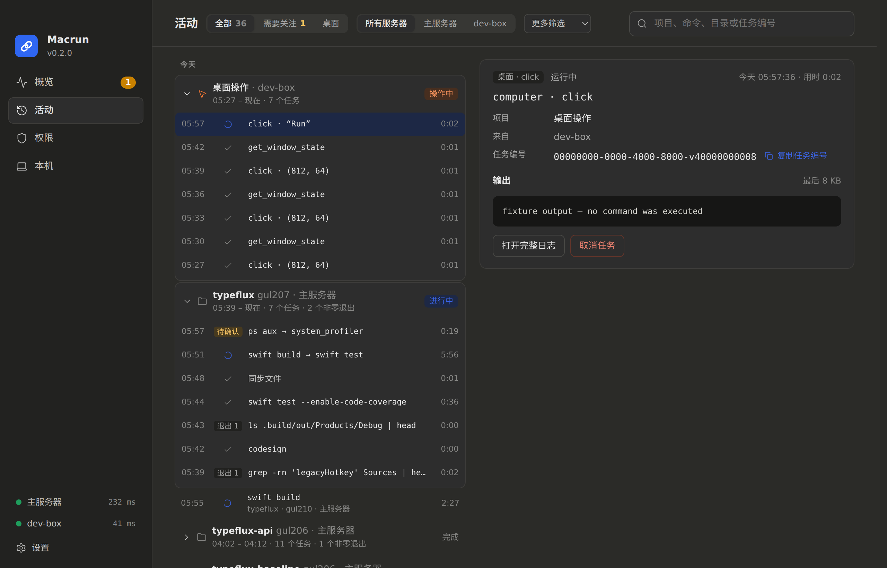 |
| **权限** | **本机** |
| 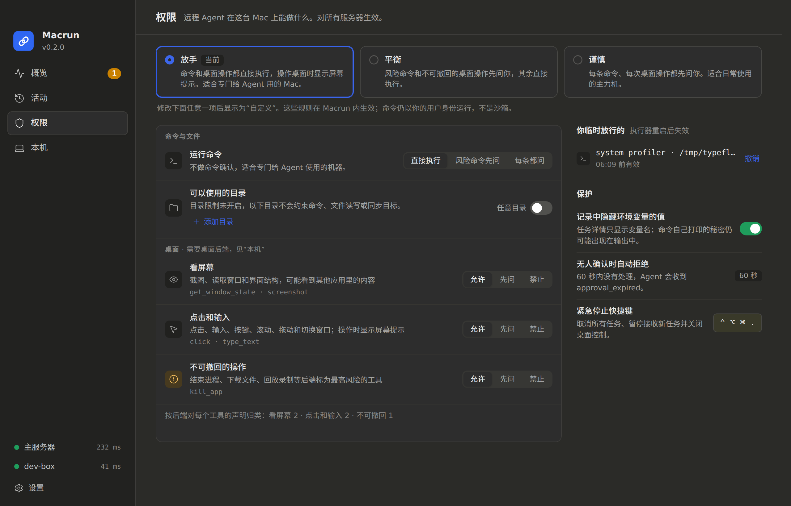 | 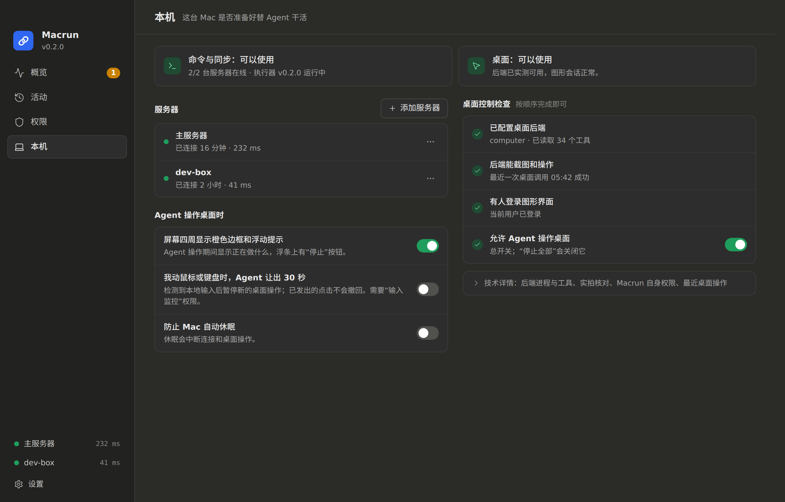 |

macOS 原生菜单栏面板（真实 `native_panel.m` + `panel_model.rs` 生成的模型，离屏渲染）：

| 工作中（浅色） | 待确认（深色） | 空闲（深色） | 部分断线 + 暂停（浅色） |
| --- | --- | --- | --- |
| 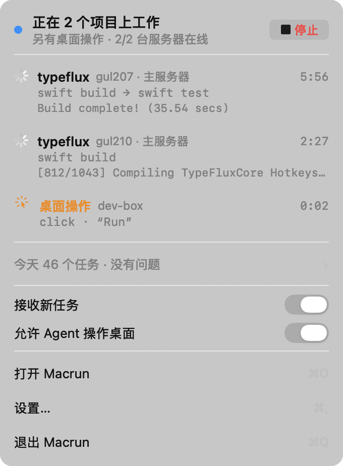 | 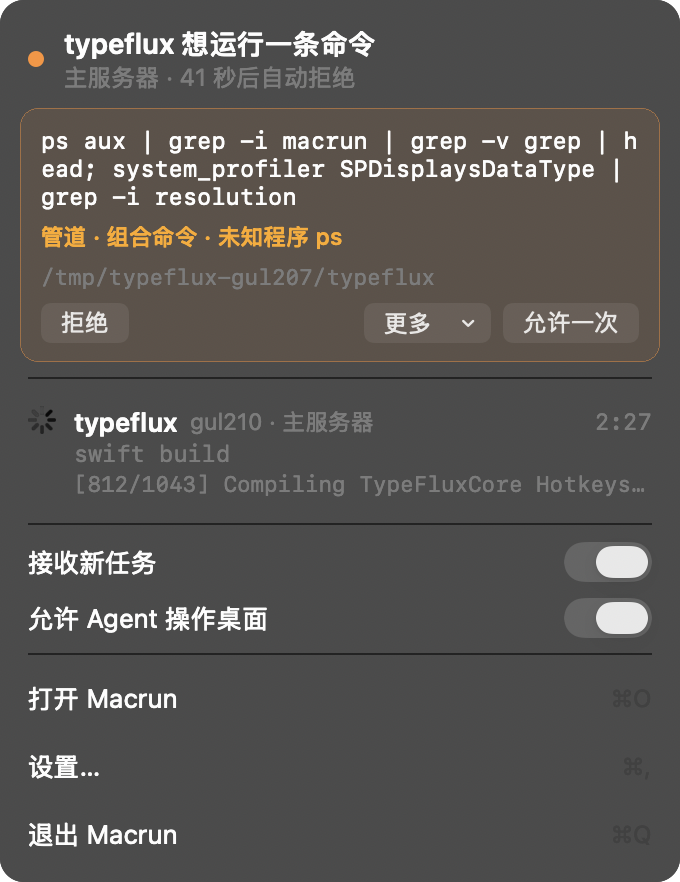 | 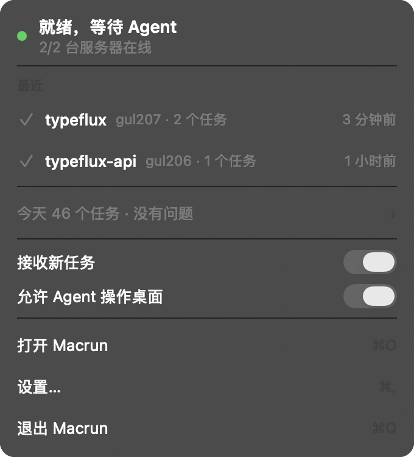 | 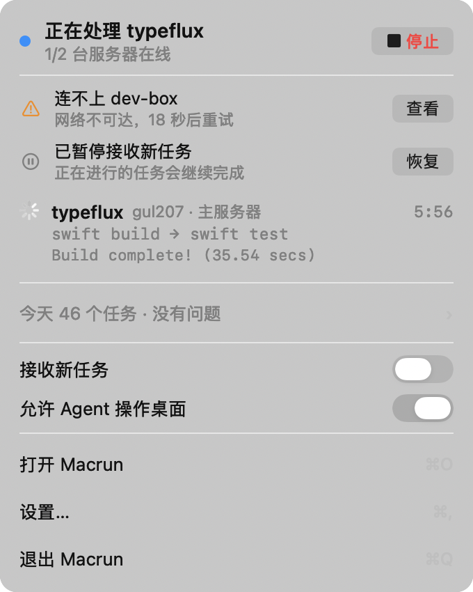 |

浅色：[overview-light.png](images/impl/overview-light.png)；设置：[settings.png](images/impl/settings.png)；网页版菜单栏面板（非 macOS）：[tray.png](images/impl/tray.png)。数据为夹具示例，不来自真实服务器。

### 改动

- **核心**：`history.rs` 新增 `exited_nonzero`，`attention` 组排除只是退出码非零的命令；`counts.exited` 和 `today_summary.exited` 单独计数；任务列表行保留 `result.exit_code`（仍不含工具结果和输出）。
- **菜单栏（macOS 原生）**：`panel_model.rs` 生成面板模型，规则与 `model.mjs` 一致，可在任何平台单测：一句话标题、唯一主操作（停止 / 恢复 / 检查连接）、确认卡片（命令全文、风险原因、目录、倒计时、“允许一次”+“更多”下拉）、按项目的进行中行（提炼后的步骤、最后一行输出、用时）、空闲时最近 2 个项目、部分服务器断线和暂停提示、“今天 N 个任务 · 没有问题”、开关、带快捷键的菜单行（⌘O / ⌘, / ⌘Q）。服务器地址替换为“主服务器 / 服务器 N”。`native_panel.m` 按模型布局，只有结构变化时重建视图，计时与输出更新原地刷新。
- **主窗口**：侧栏改为概览 / 活动 / 权限 / 本机，底部列出服务器和设置。新增 `Overview.tsx`、`Access.tsx`、`ThisMac.tsx`、`health.ts`、`format.ts`、`v4.css`；`model.mjs` 新增步骤提炼、项目归组、会话切分、问题说明和权限预设。设置页去掉安全边界（移到权限页），新增“记录”分区。
- **测试**：Rust 新增 `attention_leaves_out_commands_that_only_exited_non_zero` 和 `panel_model` 的 10 个单测；前端新增 `model-v4.test.mjs`（10 项）和 `v4.test.tsx`（11 项），并按新界面更新原有测试。

### 验证范围

- Linux：`cargo test`、`cargo clippy --all-targets -D warnings`、`cargo fmt --check`；`desktop/` 下 `npm test`（28 项 Node 测试、108 项组件测试）、`tsc`、`vite build`。新增与改动前端模块的行覆盖率：Overview 95%、Access 100%、ThisMac 87%、health 100%，整体 87%。
- macOS（通过 macrun 在独立目录 `/tmp/macrun-gul211` 构建，不触碰正式安装）：`make desktop-build PROFILE=debug` 成功；`desktop/src-tauri` 33 项测试通过；桌面与核心 Clippy 无警告。菜单栏面板用一个只链接 `native_panel.m` 的离屏渲染程序检查（`clang -Wall -Wextra` 无警告），截图即上表。
- 未完成：当时 Mac 的显示器无法截屏（`screencapture` 返回 “could not create image from display”，推测处于锁屏或息屏），所以没有在真实菜单栏中点击图标打开面板，也没有实拍主窗口。离屏渲染不包含毛玻璃材质和窗口激活后的默认按钮蓝色。正式安装前，建议在有人值守时打开菜单栏面板核对一次。

### 与设计稿的偏差

| 设计稿 | 实现 | 原因 |
| --- | --- | --- |
| 活动页滚动加载 | 保留分页，按钮改为“较新 / 更早”，每页 50 条内按日期和会话归组 | 复用已验证的游标分页与请求竞争保护，避免一次性加载上千条 |
| 待确认时菜单栏面板自动弹出 | 不自动弹出；保留系统通知和菜单栏琥珀色胶囊 | 非激活面板自动弹出会打断正在使用其他应用的人，并可能误收键盘输入 |
| 菜单栏图标新增“出问题”红点 | 沿用 v3 图标（断线已有斜线形状） | 本次不改图标绘制 |
| “无人确认时自动拒绝 60 秒 / 5 分钟”可选 | 只显示 60 秒 | 核心尚不支持可配置超时（v3 遗留 P2） |
| 桌面检查清单“屏幕未锁定” | 未加入 | 锁屏检测仍未实现（v3 遗留 P2）；清单只列 Macrun 能实际观察到的事实 |
| 后端辅助功能 / 屏幕录制分项检查 | 合并为“后端能截图和操作”，以最近一次成功的桌面调用为准 | Macrun 无法读取其他应用的系统授权，只能用实拍结果证明 |
| 设置页不出现地址 | 设置 → 连接仍显示地址和证书指纹 | 设置是连接详情与手动配置页；概览、侧栏、本机和菜单栏不显示地址 |

## 文件

- `mockups/`：静态 HTML 画板（`overview.html`、`activity.html`、`access.html`、`mac.html`、`menubar.html`）及共享样式 `v4.css`、`window.css`。URL 加 `#light` 显示浅色，加 `#clean` 隐藏粉色标注。仅用于设计评审，不是产品代码。画板中的项目名、计数和服务器名均为示例数据。
- `images/`：由画板渲染的 2× 截图。

重新生成截图：

```sh
cd docs/desktop/redesign-v4/mockups
google-chrome --headless=new --hide-scrollbars --force-device-scale-factor=2 \
  --window-size=1280,820 --screenshot=../images/overview.png "file://$PWD/overview.html"
# menubar.html 使用 --window-size=1480,600；浅色在 URL 后加 #light
```
